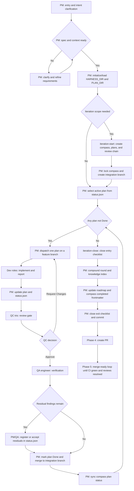

<div align="center">


# Morning Star

Code Agent Harness Framework

English / [中文](README_CN.md)

<a href="https://github.com/btspoony/mstar-harness">GitHub</a> · <a href="https://github.com/btspoony/mstar-harness/issues">Issues</a>

[](https://github.com/btspoony/mstar-harness/blob/main/LICENSE)
[](https://github.com/btspoony/mstar-harness/commits/main)

</div>

This repository provides the **Morning Star** multi-agent code harness framework.

Core value:

- Start a usable multi-role workflow quickly
- Run with unified `mstar-*` skills instead of scattered rules
- Reuse one core process across OpenCode, Cursor, and Codex

**1.0.1:** `iteration-drive` mandates per-task SDD; optional **sticky implementer** (`SDD implementer session: sticky`, Cursor Task `resume`) to reuse dev context across tasks; thin **`pm`** entry shim for general orchestration (iteration → `commands/`).

**1.0.0 highlights:** SDD (`mstar-sdd`) with per-task **task reviewer** + **mandatory plan QC tri-review** (QC#1/#2/#3 cross-review on whole branch). Single-seat `qc.md` only for `inline` / hotfix.

## Quick Start

### CLI Install

- Use the `mstar-harness` CLI (npm package `@mstar-harness/cli`):
  - `npx @mstar-harness/cli init`
  - or `bunx @mstar-harness/cli init`
- `init` provides a target-aware guided setup so installation and baseline config happen in one flow.
- CLI target support currently includes:
  - OpenCode: `npx @mstar-harness/cli init --target opencode`
  - Cursor: `npx @mstar-harness/cli init --target cursor`
  - Codex:
    - `npx @mstar-harness/cli init --target codex`
    - `codex plugin add morning-star-harness --marketplace personal`
- Cursor and Codex installs maintain a shared checkout at `~/.mstar/harness` (Codex marketplace + agent sources). **Cursor** installs a separate **real git checkout** at the plugin path — Cursor does not discover symlinked plugin directories (see [`docs/cli.md`](docs/cli.md#install-path-layout)).

For full CLI usage and advanced options (`--yes`, `--dry-run`, `--output`, `doctor`) including Cursor and Codex target install modes, see [`docs/cli.md`](docs/cli.md).

### Manual Install

Manual install targets currently include:

- `opencode`
- `cursor`
- `codex`

#### OpenCode

- Plugin install:
  - Add plugin config in `opencode.json`:
    ```json
    {
      "$schema": "https://opencode.ai/config.json",
      "plugin": [
        "@mstar-harness/opencode@latest"
      ]
    }
    ```
  - Restart OpenCode
- The OpenCode plugin resolves **skills and agents only inside `@mstar-harness/opencode`** (not `process.cwd()`). Published builds ship `harness-skills/` and `harness-agents/`. If you work from a **git checkout** of this repo, run **`bun install` / `npm install` at the repo root** so `postinstall` runs `opencode:bundle-assets` and populates those directories under `packages/opencode/`.

For detailed OpenCode setup and migration, see `packages/opencode/INSTALL.md`.

#### Cursor

- Recommended:
  - `npx @mstar-harness/cli init --target cursor --scope global`
  - Restart Cursor or run `Developer: Reload Window`
- Manual install (same layout the CLI uses; **do not symlink** the Cursor plugin path):
  - `git clone https://github.com/btspoony/mstar-harness.git ~/.mstar/harness`
  - `mkdir -p ~/.cursor/plugins/local`
  - `git clone https://github.com/btspoony/mstar-harness.git ~/.cursor/plugins/local/morning-star-harness`
  - Restart Cursor or run `Developer: Reload Window`
- **Maintainers**: develop in your workspace; refresh the Cursor plugin checkout after merge:
  - `cd ~/.cursor/plugins/local/morning-star-harness && git pull --ff-only`
  - or re-run `npx @mstar-harness/cli init --target cursor --scope global`

#### Codex

- Personal marketplace install (without the CLI):
  - Clone or update the maintained local checkout:
    - `git clone https://github.com/btspoony/mstar-harness.git ~/.mstar/harness`
  - Create or update `~/.agents/plugins/marketplace.json`:
    ```json
    {
      "name": "personal",
      "interface": {
        "displayName": "Personal"
      },
      "plugins": [
        {
          "name": "morning-star-harness",
          "source": {
            "source": "local",
            "path": "./.mstar/harness"
          },
          "policy": {
            "installation": "AVAILABLE",
            "authentication": "ON_INSTALL"
          },
          "category": "Productivity"
        }
      ]
    }
    ```
  - Install the plugin:
    - `codex plugin add morning-star-harness --marketplace personal`
  - Link Codex custom agents:
    - `mkdir -p ~/.codex/agents`
    - `ln -s ~/.mstar/harness/codex/agents/*.toml ~/.codex/agents/`
- This repository is also the **Morning Star Harness Codex plugin source**:
  - Plugin manifest: `.codex-plugin/plugin.json`
  - Runtime skills: `skills/`
  - Codex custom agents: `codex/agents/`
  - Codex runtime adaptation: `skills/mstar-host/references/codex.md`

That completes installation.

## How to use

- **OpenCode**: start with the `Project Manager` role (`agents/project-manager.md`, typically `agent.project-manager` in `opencode.json`).
- **Cursor**: use `/pm` to force-start with the `Project Manager` role.
- **Codex**: use `/pm` to force-start with the `Project Manager` role after installing the plugin.
  Codex loads shared skills and custom agents from `codex/agents/` when linked by the CLI/manual install.

### Harness Commands

The shared `commands/` directory currently provides these PM-led harness commands:

| Command | Available in | Use when |
|---------|--------------|----------|
| `/mstar-bootstrap` | Cursor, OpenCode | Bootstrap or refresh project knowledge scaffolding: `STRATEGY.md`, `CONCEPTS.md`, `{KNOWLEDGE_DIR}`, and related indexes. |
| `/iteration-start` | Cursor, OpenCode | Start a new harness iteration: research backlog, lock direction, write compass/plans, run the review chain, and create the integration branch. |
| `/iteration-drive` | Cursor, OpenCode | Drive an active iteration (Phase 2 execute loop → Phase 3 iteration-close → Phase 4 create PR → Phase 5 merge-ready loop until CI green and reviews resolved). |

In OpenCode, install or update `@mstar-harness/opencode` and restart OpenCode; the plugin bundles these markdown commands from `harness-commands/`.

In Cursor, install or update the Cursor plugin link and reload the window; the commands are discovered from this repository's `commands/` directory alongside the shared agents, skills, and rules.

## Harness Workflow



For single-plan or non-iteration work, use the same per-plan gates (`Prepare → Execute → QC → QA → Done`) without the iteration-start / iteration-close wrapper.

## Role and Skill Overview

### Roles

| Agent ID | Role | Responsibility |
|----------|------|----------------|
| `project-manager` | Project Manager | Routing, assignment, phase progression |
| `product-manager` | Product Manager | Requirements, product planning, and market/user research |
| `architect` | Architect | Architecture and technical contracts |
| `fullstack-dev` / `fullstack-dev-2` | Fullstack Dev | Backend-led implementation / second parallel track |
| `frontend-dev` | Frontend Dev | UI, interaction, frontend performance |
| `qa-engineer` | QA | Testing and acceptance validation |
| `qc-specialist` / `qc-specialist-2` / `qc-specialist-3` | QC Trio | Code quality gate (architecture/security/performance) |
| `ops-engineer` | Ops | Deployment, monitoring, infrastructure |
| `writing-specialist` | Writing Specialist | Documentation, fiction, copywriting, and script writing |
| `prompt-engineer` | Prompt Engineer | Prompt / skill / rule optimization |

You can assign different models per agent in `opencode.json` without replacing your existing file.

### Core Skills

Load **`mstar-harness-core` first**, then topic skills **on demand** (see `mstar-roles` for per-role lists).

| Skill | Purpose |
|-------|---------|
| `mstar-harness-core` | Global entry, state machine, Task category, skill index |
| `mstar-phase-gates` | Prepare/Execute gates, clarify, hotfix |
| `mstar-iteration` | Iteration lifecycle: Phase 1–5 (start, execute loop, iteration-close, PR delivery, merge-ready loop) |
| `mstar-dispatch-gates` | PM dispatch, Delegation, anti-recursion, parallel invoke |
| `mstar-sdd` | Subagent-driven development: file handoffs, per-task implementer + reviewer, progress ledger |
| `mstar-branch-worktree` | Feature branches, worktrees, QC/QA checkout alignment |
| `mstar-plan-conventions` | `{HARNESS_DIR}` discovery, init, Spec branch summary |
| `mstar-plan-artifacts` | Main plan, `reports/`, `status.json`, residuals, knowledge/iteration indexes, Done compaction |
| `mstar-design-md` | DESIGN.md design-system gate for UI-bearing plans |
| `mstar-review-qc` | QC review baseline and report template |
| `mstar-coding-behavior` | Cross-role coding behavior: RCA, test-first checks, review feedback, completion evidence |
| `mstar-compound` | Knowledge crystallization into `{KNOWLEDGE_DIR}` |
| `mstar-compound-refresh` | Knowledge maintenance: refresh, merge, archive, or remove stale docs |
| `mstar-strategy` | STRATEGY.md alignment for long-running direction and decisions |
| `mstar-skill-authoring` | Skill authoring, trigger contracts, progressive disclosure, and behavior-change evidence |
| `mstar-roles` | Role prompt bus + per-role skill load lists |
| `mstar-host` | Host adapter (OpenCode / Cursor / Codex); auto-detect + `references/` |
| `pm` | Shared `/pm` shortcut for Cursor and Codex PM entry |

Maintainers: in-repo design notes under **`.harness/`** (gitignored) for specs/plans during harness work — not the published skill tree.

Project plan artifacts default to **`.mstar/`** (`{HARNESS_DIR}`), with existing `.agents/` / `.plans/` / `plans/` layouts still recognized for compatibility.

## License

This project is licensed under MIT. See [LICENSE](./LICENSE).
