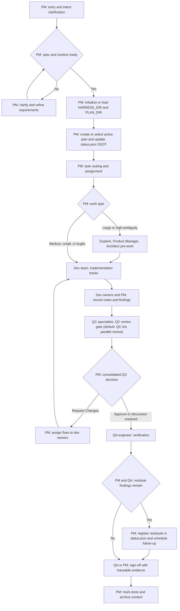

<div align="center">

### Morning Star — Code Agent Harness Framework

English / [中文](README_CN.md)

<a href="https://github.com/btspoony/mstar-harness">GitHub</a> · <a href="https://github.com/btspoony/mstar-harness/issues">Issues</a>

[](https://github.com/btspoony/mstar-harness/blob/main/LICENSE)
[](https://github.com/btspoony/mstar-harness/commits/main)

</div>

This repository provides the **Morning Star** multi-agent code harness framework.

Core value:

- Start a usable multi-role workflow quickly
- Run with unified `mstar-*` skills instead of scattered rules
- Reuse one core process across OpenCode, Cursor, and Codex

## Quick Start

### CLI Install

- Use the `mstar-harness` CLI (npm package `@mstar-harness/cli`):
  - `npx @mstar-harness/cli init`
  - or `bunx @mstar-harness/cli init`
- `init` provides a target-aware guided setup so installation and baseline config happen in one flow.
- CLI target support currently includes:
  - `opencode`
  - `cursor`

For full CLI usage and advanced options (`--yes`, `--dry-run`, `--output`, `doctor`) including Cursor target install modes, see [`docs/cli.md`](docs/cli.md).

### Manual Install

Manual install targets currently include:

- `opencode`
- `cursor`
- `codex`

#### OpenCode

- Plugin install:
  - Add plugin config in `opencode.json`:
    ```json
    {
      "$schema": "https://opencode.ai/config.json",
      "plugin": [
        "superpowers@git+https://github.com/obra/superpowers.git",
        "@mstar-harness/opencode@latest"
      ]
    }
    ```
  - Restart OpenCode
- The OpenCode plugin resolves **skills and agents only inside `@mstar-harness/opencode`** (not `process.cwd()`). Published builds ship `harness-skills/` and `harness-agents/`. If you work from a **git checkout** of this repo, run **`bun install` / `npm install` at the repo root** so `postinstall` runs `opencode:bundle-assets` and populates those directories under `packages/opencode/`.

For detailed OpenCode setup and migration, see `packages/opencode/INSTALL.md`.

#### Cursor

- Local plugin install (direct clone):
  - `mkdir -p ~/.cursor/plugins/local`
  - `git clone https://github.com/btspoony/mstar-harness.git ~/.cursor/plugins/local/mstar-harness`
  - Restart Cursor or run `Developer: Reload Window`

#### Codex

- Marketplace install:
  - `codex plugin marketplace add https://github.com/btspoony/mstar-harness.git --sparse .codex/`
  - Install **Morning Star Harness** from the added marketplace.

That completes installation.

## How to use

- **OpenCode**: start with the `Project Manager` role (`agents/project-manager.md`, typically `agent.project-manager` in `opencode.json`).
- **Cursor**: use `/pm` to force-start with the `Project Manager` role.
- **Codex**: use `/pm` to force-start with the `Project Manager` role after installing the plugin.

## Harness Workflow



## Role and Skill Overview

### Roles

| Agent ID | Role | Responsibility |
|----------|------|----------------|
| `project-manager` | Project Manager | Routing, assignment, phase progression |
| `product-manager` | Product Manager | Requirements, product planning, and market/user research |
| `architect` | Architect | Architecture and technical contracts |
| `fullstack-dev` / `fullstack-dev-2` | Fullstack Dev | Backend-led implementation / second parallel track |
| `frontend-dev` | Frontend Dev | UI, interaction, frontend performance |
| `qa-engineer` | QA | Testing and acceptance validation |
| `qc-specialist` / `qc-specialist-2` / `qc-specialist-3` | QC Trio | Code quality gate (architecture/security/performance) |
| `ops-engineer` | Ops | Deployment, monitoring, infrastructure |
| `writing-specialist` | Writing Specialist | Documentation, fiction, copywriting, and script writing |
| `prompt-engineer` | Prompt Engineer | Prompt / skill / rule optimization |

You can assign different models per agent in `opencode.json` without replacing your existing file.

### Core Skills

| Skill | Purpose |
|-------|---------|
| `mstar-harness-core` | Global entry, state machine, gates, invariants |
| `mstar-host` (per host) | Host-specific capabilities (OpenCode / Cursor) |
| `pm` | Shared `/pm` shortcut for Cursor and Codex PM entry |
| `mstar-roles` | Role prompt bus (role bodies in `references/`) |
| `mstar-plan-conventions` | Unified plan/status/residual conventions |
| `mstar-review-qc` | QC review baseline and report template |
| `mstar-coding-behavior` | Cross-role coding behavior baseline |
| `mstar-superpowers-align` | Alignment and conflict handling with Superpowers |

### Plan bootstrap templates

When enabling plan management, copy the empty harness starters from [`skills/mstar-plan-conventions/templates/`](./skills/mstar-plan-conventions/templates/) into `{HARNESS_DIR}` (commonly `.agents/`): `status.empty.json` → `status.json`, and optionally `notes.empty.json` → `notes.json`. Residual canonical vs legacy fallback is defined once in [`skills/mstar-plan-conventions/SKILL.md`](./skills/mstar-plan-conventions/SKILL.md) (opening section). See also [`skills/mstar-plan-conventions/templates/README.md`](./skills/mstar-plan-conventions/templates/README.md).

## License

This project is licensed under MIT. See [LICENSE](./LICENSE).
