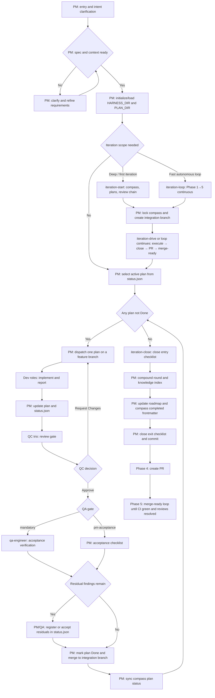

<div align="center">


# Morning Star

Code Agent Harness Framework

English / [中文](README_CN.md)

<a href="https://github.com/btspoony/mstar-harness">GitHub</a> · <a href="https://github.com/btspoony/mstar-harness/issues">Issues</a>

[](https://github.com/btspoony/mstar-harness/blob/main/LICENSE)
[](https://github.com/btspoony/mstar-harness/commits/main)

</div>

This repository provides the **Morning Star** multi-agent code harness framework.

Core value:

- Start a usable multi-role workflow quickly
- Run with unified `mstar-*` skills instead of scattered rules
- Reuse one core process across OpenCode, Cursor, and Codex

Latest release: **1.2.1** — see [CHANGELOG.md](CHANGELOG.md) / [CHANGELOG_CN.md](CHANGELOG_CN.md).

## Quick Start

Recommended install uses the CLI (`@mstar-harness/cli`):

```bash
npx @mstar-harness/cli init
# or: bunx @mstar-harness/cli init
```

Per-target examples:

- OpenCode: `npx @mstar-harness/cli init --target opencode`
- Cursor: `npx @mstar-harness/cli init --target cursor`
- Codex: `npx @mstar-harness/cli init --target codex` then `codex plugin add morning-star-harness --marketplace personal`

`init` provides target-aware guided setup (scopes, path layout, baseline config). Verify with `npx @mstar-harness/cli doctor --target <opencode|cursor|codex>`.

**Detailed install** (manual steps, path layout, Codex project vs global): [`INSTALL.md`](INSTALL.md). **CLI flags and advanced options:** [`docs/cli.md`](docs/cli.md).

## How to use

- **OpenCode**: start with the `Project Manager` role (`agents/project-manager.md`, typically `agent.project-manager` in `opencode.json`).
- **Cursor**: use `/pm` to force-start with the `Project Manager` role.
- **Codex**: use `/pm` after installing the plugin. Custom agents are linked from `codex/agents/` by the CLI or manual install.

### Harness Commands

Three PM-led iteration entry points. Pick by how much human direction you need:

| Path | When | Flow |
|------|------|------|
| `/iteration-start` → `/iteration-drive` | First iteration, or deep work that needs human direction lock (**grill-me**) before execution | Phase 1 only → Phase 2–5 (execute, close, PR, merge-ready) |
| `/iteration-loop` | Fast autonomous full loop (cloud-agent friendly); optional `direction` + `scale` (S\|M\|L) | Phase 1→5 continuous with minimal check-ins |

**Where commands load:**

| Host | Discovery |
|------|-----------|
| **Cursor / OpenCode** | Bundled from this repo's `commands/` (OpenCode: `harness-commands/` in the plugin) |
| **Codex (project install)** | Same three commands as project-local skills: `.agents/skills/<name>/SKILL.md` (CLI symlinks from `commands/`) |
| **Codex (global install)** | Iteration skills are **not** installed — use `--scope project` to avoid polluting other projects |

Project knowledge bootstrap/refresh: `mstar-compound-refresh` skill (`references/project-knowledge-bootstrap.md`).

After install, reload the host (restart OpenCode / Cursor **Developer: Reload Window** / re-open Codex).

## Harness Workflow



For single-plan or non-iteration work, use the same per-plan gates (`Prepare → Execute → QC → QA gate → Done`) without the iteration-start / iteration-close wrapper.

## Role and Skill Overview

### Roles

| Agent ID | Role | Responsibility |
|----------|------|----------------|
| `project-manager` | Project Manager | Routing, assignment, phase progression |
| `product-manager` | Product Manager | Requirements, product planning, and market/user research |
| `architect` | Architect | Architecture and technical contracts |
| `fullstack-dev` / `fullstack-dev-2` | Fullstack Dev | Backend-led implementation / second parallel track |
| `frontend-dev` | Frontend Dev | UI, interaction, frontend performance |
| `qa-engineer` | QA | Tiered acceptance validation (dispatched when `QA gate: mandatory`; else PM acceptance) |
| `qc-specialist` / `qc-specialist-2` / `qc-specialist-3` | QC Trio | Code quality gate (architecture/security/performance) |
| `ops-engineer` | Ops | Deployment, monitoring, infrastructure |
| `writing-specialist` | Writing Specialist | Documentation, fiction, copywriting, and script writing |
| `prompt-engineer` | Prompt Engineer | Prompt / skill / rule optimization |

You can assign different models per agent in `opencode.json` without replacing your existing file.

### Core Skills

Load **`mstar-harness-core` first**, then topic skills **on demand** (see `mstar-roles` for per-role lists).

| Skill | Purpose |
|-------|---------|
| `mstar-harness-core` | Global entry, state machine, Task category, skill index |
| `mstar-phase-gates` | Prepare/Execute gates, clarify, hotfix |
| `mstar-iteration` | Iteration lifecycle: Phase 1–5 (start, execute loop, iteration-close, PR delivery, merge-ready loop) |
| `mstar-dispatch-gates` | PM dispatch, Delegation, anti-recursion, parallel invoke |
| `mstar-sdd` | Subagent-driven development: file handoffs, per-task implementer + reviewer, progress ledger |
| `mstar-branch-worktree` | Feature branches, worktrees, QC/QA checkout alignment |
| `mstar-plan-conventions` | `{HARNESS_DIR}` discovery, init, Spec branch summary |
| `mstar-plan-artifacts` | Main plan, review bundles / durable summaries, `status.json`, residuals, knowledge/iteration indexes, Done compaction |
| `mstar-design-md` | DESIGN.md design-system gate for UI-bearing plans |
| `mstar-review-qc` | PM QC tri orchestration, residual gate, layer boundaries; leaf execution → `mstar-roles/references/qc-specialist/` |
| `mstar-coding-behavior` | Cross-role coding behavior: RCA, test-first checks, review feedback, completion evidence |
| `mstar-compound` | Knowledge crystallization into `{KNOWLEDGE_DIR}` |
| `mstar-compound-refresh` | Knowledge maintenance: refresh, merge, archive, or remove stale docs |
| `mstar-strategy` | STRATEGY.md alignment for long-running direction and decisions |
| `mstar-skill-authoring` | Skill authoring, trigger contracts, progressive disclosure, and behavior-change evidence |
| `mstar-roles` | Role prompt bus + per-role skill load lists |
| `mstar-host` | Host adapter (OpenCode / Cursor / Codex); auto-detect + `references/` |
| `pm` | Shared `/pm` shortcut for Cursor and Codex PM entry |

Maintainers: follow [`AGENTS.md`](AGENTS.md) for in-repo maintenance notes and planning; those local artifacts are not part of the published skill tree.

Project plan artifacts default to **`.mstar/`** (`{HARNESS_DIR}`), with existing `.agents/` / `.plans/` / `plans/` layouts still recognized for compatibility.

## License

This project is licensed under MIT. See [LICENSE](./LICENSE).
