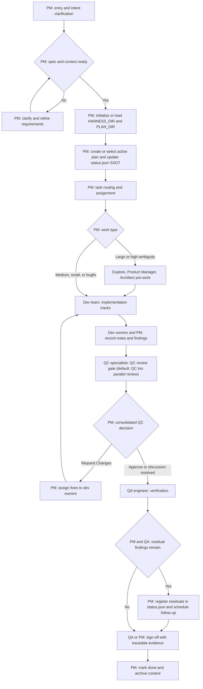

<div align="center">

### Morning Star — Code Agent Harness Framework

English / [中文](README_CN.md)

<a href="https://github.com/btspoony/mstar-harness">GitHub</a> · <a href="https://github.com/btspoony/mstar-harness/issues">Issues</a>

[](https://github.com/btspoony/mstar-harness/blob/main/LICENSE)
[](https://github.com/btspoony/mstar-harness/commits/main)

</div>

This repository provides the **Morning Star** multi-agent code harness framework.

Core value:

- Start a usable multi-role workflow quickly
- Run with unified `mstar-*` skills instead of scattered rules
- Reuse one core process across OpenCode, Cursor, and Codex

## Quick Start

### Cursor Installation

- Local plugin install (direct clone):
  - `mkdir -p ~/.cursor/plugins/local`
  - `git clone https://github.com/btspoony/mstar-harness.git ~/.cursor/plugins/local/mstar-harness`
  - Restart Cursor or run `Developer: Reload Window`

### OpenCode Installation

- Plugin install (recommended):
  - Add plugin config in `opencode.json`:
    ```json
    {
      "plugin": [
        "superpowers@git+https://github.com/obra/superpowers.git",
        "morning-star@git+https://github.com/btspoony/mstar-harness.git"
      ]
    }
    ```
  - Restart OpenCode

### Codex Installation

- Marketplace install (recommended):
  - `codex plugin marketplace add https://github.com/btspoony/mstar-harness.git --sparse .codex/`
  - Install **Morning Star Harness** from the added marketplace.

That completes installation.

You can assign different models per agent in `opencode.json` without replacing your existing file. For detailed OpenCode setup and migration, see `.opencode/INSTALL.md`.

## How to use

- **OpenCode**: start with the `Project Manager` role (`agents/project-manager.md`, typically `agent.project-manager` in `opencode.json`).
- **Cursor**: use `/pm` to force-start with the `Project Manager` role.
- **Codex**: use `/pm` to force-start with the `Project Manager` role after installing the plugin.

## Role and Skill Overview

### Roles

| Agent ID | Role | Responsibility |
|----------|------|----------------|
| `project-manager` | Project Manager | Routing, assignment, phase progression |
| `product-manager` | Product Manager | Requirements and product-facing docs |
| `architect` | Architect | Architecture and technical contracts |
| `fullstack-dev` / `fullstack-dev-2` | Fullstack Dev | Backend-led implementation / second parallel track |
| `frontend-dev` | Frontend Dev | UI, interaction, frontend performance |
| `qa-engineer` | QA | Testing and acceptance validation |
| `qc-specialist*` | QC Trio | Code quality gate (architecture/security/performance) |
| `ops-engineer` | Ops | Deployment, monitoring, infrastructure |
| `market-expert` | Market Expert | Market and user research |
| `prompt-engineer` | Prompt Engineer | Prompt / skill / rule optimization |

### Core Skills

| Skill | Purpose |
|-------|---------|
| `mstar-harness-core` | Global entry, state machine, gates, invariants |
| `mstar-host` (per host) | Host-specific capabilities (OpenCode / Cursor) |
| `pm` | Shared `/pm` shortcut for Cursor and Codex PM entry |
| `mstar-roles` | Role prompt bus (role bodies in `references/`) |
| `mstar-plan-conventions` | Unified plan/status/residual conventions |
| `mstar-review-qc` | QC review baseline and report template |
| `mstar-coding-behavior` | Cross-role coding behavior baseline |
| `mstar-superpowers-align` | Alignment and conflict handling with Superpowers |

## Harness Workflow



## License

This project is licensed under MIT. See [LICENSE](./LICENSE).
