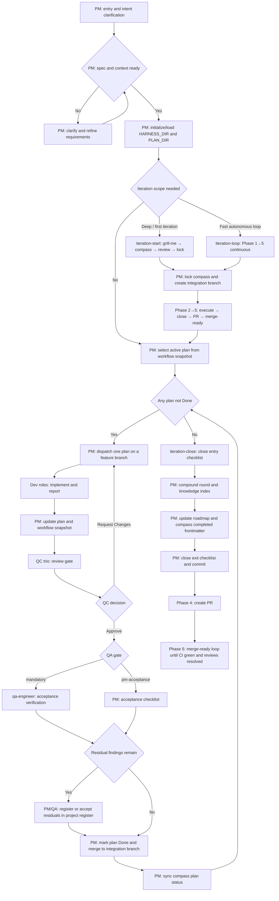

<div align="center">


# [Morning Star](https://github.com/btspoony/mstar-harness)

Harness Workflow Engine · Agent Plugin

English / [中文](README_CN.md)

<a href="https://github.com/btspoony/mstar-harness">GitHub</a> · <a href="https://github.com/btspoony/mstar-harness/issues">Issues</a>

[](https://github.com/btspoony/mstar-harness/actions/workflows/ci.yml)
[](LICENSE)
[](https://github.com/btspoony/mstar-harness/releases)
[](https://github.com/btspoony/mstar-harness/commits/main)
[](https://dshfind.com/zh/plugins/btspoony/mstar-harness?ref=badge)
[](https://www.greptile.com/?utm_source=oss_badge&utm_medium=readme&utm_campaign=greptile_for_open_source)


[](https://www.npmjs.com/package/@mstar-harness/cli)
[](https://www.npmjs.com/package/@mstar-harness/dsh)
[](https://www.npmjs.com/package/@mstar-harness/omp)
[](https://www.npmjs.com/package/@mstar-harness/opencode)
</div>

**Morning Star** is an Agent Plugin for harness engineering workflows: a TypeScript **Harness Workflow Engine** (`@mstar-harness/engine`) enforces deterministic workflow gates, while `mstar-*` judgment skills drive multi-agent code delivery.

- **Deterministic gates, enforced by a TS engine** — path/status/lease/dispatch/sdd/iteration/lint gates run in `@mstar-harness/engine`, not as prompt suggestions
- **Judgment stays in `mstar-*` skills** — skills remain the single source of truth (SSOT) for roles, gates, and workflow judgment
- **One engine across hosts** — the same engine + skills power dsh (DeepSeek Harness), omp, OpenCode, Cursor, Kimi Code, ZCode, and Codex
- **Agent Plugin packaging** — one-command install; portable across any Agent Plugins v1.0.0 client
- **Pluggable JSON persistence** — coordination docs (`status.json`, workflow snapshots, project residuals, review envelopes) persist through an `ArtifactStore`; the default `FsStore` keeps the existing `.mstar/` paths, and integrations mount their own store via `MSTAR_STORE_MODULE` / `--store` / in-process `setArtifactStore`
- **Issue/catalog store vs execution JSON** — `{HARNESS_DIR}/store.db` (SQLite) is the issue and catalog authority after activation; `ArtifactStore` remains execution/review JSON (`status.json`, snapshots, residuals). They are not the same store.
- **Recommended host** (best → usable): **dsh = omp ≥ ZCode = OpenCode = Cursor > Kimi > Codex**

**What ships**

| Component | What it is |
|-----------|------------|
| Harness Workflow Engine | `@mstar-harness/engine` — TS enforcement of deterministic workflow gates |
| mstar CLI | `@mstar-harness/cli` — installer bootstrap + `mstar` workflow verbs |
| `mstar-*` skills | Role, gate, and workflow judgment (single source of truth) |
| Host adapters | dsh, omp, OpenCode, Cursor, Kimi Code, ZCode, Codex |

Release notes: [CHANGELOG.md](CHANGELOG.md) / [CHANGELOG_CN.md](CHANGELOG_CN.md).

## Install

| Host | Command |
|------|---------|
| dsh (DeepSeek Harness) | `npx @mstar-harness/cli init --target dsh`<br>(one CLI command that runs two **independent** `dsh plugin --profile web add` installs:<br>`@mstar-harness/dsh` + `dsh-llm-fallbacks`; `--no-fallbacks` skips the latter)<br>or `dsh plugin --profile web add @mstar-harness/dsh`<br>+ `dsh plugin --profile web add dsh-llm-fallbacks` |
| omp | `npx @mstar-harness/cli init --target omp`<br>(links `~/.mstar/harness/packages/omp`)<br>or `omp plugin install @mstar-harness/omp` |
| OpenCode | `npx @mstar-harness/cli init --target opencode` |
| Cursor | `npx @mstar-harness/cli init --target cursor` |
| Kimi | Kimi TUI: `/plugins install https://github.com/btspoony/mstar-harness`<br>→ `/plugins reload` |
| ZCode | `npx @mstar-harness/cli init --target zcode`<br>then install **morning-star-harness** in ZCode → Settings → Plugin Management |
| Codex | `npx @mstar-harness/cli init --target codex`<br>then `codex plugin add morning-star-harness@mstar-repo` (repo-bundled marketplace) |
| Generic (Agent Plugins v1) | point any Agent Plugins v1.0.0 conformant client at this repo root<br>(`plugin.json` + `skills/` are the portable package) |

> CLI commands in this section run the published bin through its Bun shebang: `npx` / `bunx` / `npm i -g` all need **Bun >=1.4.0** on PATH. Node-only machine: `npm install @mstar-harness/cli`, then `node node_modules/@mstar-harness/cli/dist/mstar-harness.js <verb>` (see **Runtime floors**).

### Engine gate checks (Recommended)

```bash
npm i -g @mstar-harness/cli
```

Puts the `mstar-harness` binary (short alias `mstar`) on PATH, so the engine-check commands the skills cite (`mstar status validate`, `mstar dispatch validate`, `mstar iteration gate`, …) actually run.

`init` now auto-installs the matching-version CLI globally after a successful run — pass `--no-global-cli` to opt out.

Without a global install the harness still works and those checks stay advisory. Set `enforcement: hard` in an iteration compass to make dispatch preflights fail-fast.

> **Caution**: `mstar` is a short alias and a **shared bin namespace** — an unrelated third-party npm package named `mstar` claims the same command name. The alias exists only where `@mstar-harness/cli` is installed: bare `npx mstar …` without the package resolves via the registry to that other tool, and globally co-installing both packages silently overwrites the `mstar` shim (last install wins). The canonical invocation name stays `mstar-harness` — use the long name on any conflict.

### Verify

`npx @mstar-harness/cli doctor --target <opencode\|cursor\|codex\|zcode\|omp\|dsh>`.

Codex agent-link repair and named-role verification: [Codex installation](INSTALL.md#codex).

The repo ships a portable **Agent Plugins v1.0.0** manifest (`plugin.json`) at its root; `skills/` is the Agent Skills component — verify it with `npx @mstar-harness/cli plugin validate`.

Manual install / path layout: [`INSTALL.md`](INSTALL.md). CLI flags: the **`mstar-use-cli`** skill.

### Runtime floors (entrypoint, not “install both”)

The published CLI keeps a Bun shebang (`#!/usr/bin/env bun`). Normal launch of `mstar-harness` / the dist file uses **Bun >=1.4.0**. An explicit `node <CLI bundle>` uses **Node >=24.18.0**. `npx` / `bunx` fetch the package but still execute that same Bun-shebang bin, so they need **Bun >=1.4.0** on PATH as well — a package runner is not a runtime; on a Node-only machine install the package and run the bundle under Node (`node node_modules/@mstar-harness/cli/dist/mstar-harness.js <verb>`). Bun-hosted plugins need Bun; native Node entries need Node. Do not treat those floors as a demand to install both runtimes on every machine. This README does not prove packaged compatibility or store activation.

## Use

Three entry shapes: **without iteration** (single plan / hotfix), **with iteration** (multi-plan Phase 1–5), or **audit, review & verification** (discover work, assess changes, or run requested E2E checks).

Full command reference: [`docs/commands.md`](docs/commands.md).

### General (without iteration)

Enter PM, then run the per-plan cycle: `Prepare → Execute → QC → QA gate → Done`.

| Host | Enter PM |
|------|----------|
| dsh (DeepSeek Harness) | `pm` skill (via the mstar skill provider; no auto-load) |
| omp | `/skill:pm` each session (no auto-load) |
| OpenCode | `agent.project-manager` (OpenCode-only shell, `packages/opencode/agents/project-manager.md`) |
| Cursor | `/pm` |
| Kimi | session auto-loads `pm`; or `/skill:pm` |
| ZCode | `/morning-star-harness:pm` each session (no auto-load) |
| Codex | `/pm` |

### Iteration

| Command | When |
|---------|------|
| `/iteration-start [direction] [pause]` | Start a new iteration: Phase 1 (interactive grill-me), then auto-continue Phase 2→6.<br>`direction` — optional hint (still interactive).<br>`pause` — stop after Phase 1; resume with `/iteration-drive`. |
| `/iteration-drive` | Resume Phase 2→6 on an already-locked iteration. |
| `/iteration-loop [direction] [scale]` | Full Phase 1→6 autonomous (no grill-me).<br>`direction` — optional free text.<br>`scale` — `S` / `M` / `L` / `XL` (default `M`). |

### Scoped plan session

The same command takes a scope, to drive **one** prepared plan from an independent terminal instead of the whole iteration:

| Command | When |
|---------|------|
| `/iteration-drive --assignment <absolute-assignment-md-path>` | Fresh scoped entry, addressed by the coordinator's prepared Assignment. |
| `/iteration-drive --workflow <workflow-id> --plan <plan-id>` | Fresh scoped entry, addressing the prepared row directly. |
| `/iteration-drive --resume <absolute-session-json-path>` | Explicit resume of the already bound session — the only resume form. |

The scoped session binds exactly one plan, drives its tasks through the normal per-plan gates, and stops at a durable **handoff**: the row keeps `InReview`, and the coordinator alone records `Done` — after a verified merge on the iteration route, or straight from the accepted handoff on the standalone development route. A second fresh entry for the same plan is rejected as a duplicate holder — only explicit `--resume` of the original session continues. Any other nonempty argument shape fails closed; no arguments keep the whole-iteration route above.

The second terminal is transport, not a dependency: any terminal works, and a multiplexer such as Herdr or tmux is optional — nothing reads pane state, TTL or terminal labels for ownership.

The coordinator's half — `prepare`, then `accept`, and from there the iteration route (`integration-start` → pinned merge → `integration-accept` → `complete`) or the standalone development route (`complete` straight from the accepted handoff), with `reconcile` as the crash path — runs the `mstar plan` verbs; flags, JSON envelopes and exit codes: **`mstar-use-cli`** → `references/plan-and-workflow.md`.

Recipe: [`docs/commands.md`](docs/commands.md#iteration-drive).

### Audit, review & verification

The audit and review commands are read-only and advisory; findings can become plans for Prepare → Execute. SSOT → `mstar-audit` (variants: `codebase-audit`, `pr`).

| Command | When |
|---------|------|
| `/codebase-audit [keywords]` | Read-only survey of what's worth doing — prioritized, ready-to-execute plans; narrow it with category focus (`bug`, `security`, `perf`, `tech-debt`, …) when you want a targeted pass. |
| `/amazing-pr-review [pr\|branch\|scope] [quick\|default\|deep]` | Deep pre-merge review of a PR / branch / diff at three strengths — `quick` (single-pass, 1 seat) / `default` (no-flag landing tier, reduced seats) / `deep` (full three-stage pipeline) — one verdict (`ship it` / `needs fixes` / `blocked`) and every finding, posted to GitHub by the command's main agent at Stage 3 synthesis when a PR number is given. `deep` runs the full three-stage pipeline (collect → domain review → main-agent synthesis; one verdict / one GitHub Review); `default` / `quick` are lighter single/dual-seat passes. Multi-PR input → first PR only; remaining PRs queued as audit todos (next session); suggest one session per PR. |
| `/amazing-e2e-check [environment/device] [scenarios]` | Execute explicitly requested browser/device/installed-deployment scenarios through `mstar-e2e` in a separate workflow; never a routine iteration QA gate. |

### Local dashboard

`mstar dashboard` serves a **read-only** web UI of the issue store and the execution/roadmap projections on `127.0.0.1` — loopback only, with no bind-address option. It covers the issue list and detail with recorded history, the workflow / iteration / roadmap views, and one cumulative captured-vs-retired issue-flow chart. The dashboard never mutates anything; make changes with the CLI (`mstar issue …`, `mstar catalog …`) and stop the server with Ctrl-C.

```
mstar dashboard            # prints the resolved URL after the server is listening
mstar dashboard --help     # --port / --open / --project
```

## Harness Workflow


```mermaid
flowchart TD
    A["PM: entry and intent clarification"] --> B{"PM: spec and context ready"}
    B -->|No| C["PM: clarify and refine requirements"]
    C --> B
    B -->|Yes| D["PM: initialize/load HARNESS_DIR and PLAN_DIR"]
    D --> E{"Iteration scope needed"}
    E -->|Deep / first iteration| F["iteration-start: grill-me → compass → review → lock"]
    E -->|Fast autonomous loop| F2["iteration-loop: Phase 1→5 continuous"]
    F --> G["PM: lock compass and create integration branch"]
    F2 --> G
    G --> H["Phase 2→5: execute → close → PR → merge-ready"]
    E -->|No| I["PM: select active plan from workflow snapshot"]
    H --> I
    I --> J{"Any plan not Done"}
    J -->|Yes| K["PM: dispatch one plan on a feature branch"]
    K --> L["Dev roles: implement and report"]
    L --> M["PM: update plan and workflow snapshot"]
    M --> N["QC trio: review gate"]
    N --> O{"QC decision"}
    O -->|Request Changes| K
    O -->|Approve| P{"QA gate"}
    P -->|mandatory| P1["qa-engineer: acceptance verification"]
    P -->|pm-acceptance| P2["PM: acceptance checklist"]
    P1 --> Q{"Residual findings remain"}
    P2 --> Q
    Q -->|Yes| R["PM/QA: register or accept residuals in project register"]
    R --> S["PM: mark plan Done and merge to integration branch"]
    Q -->|No| S
    S --> T["PM: sync compass plan status"]
    T --> J
    J -->|No| U["iteration-close: close entry checklist"]
    U --> V["PM: compound round and knowledge index"]
    V --> W["PM: update roadmap and compass completed frontmatter"]
    W --> X["PM: close exit checklist and commit"]
    X --> Y["Phase 4: create PR"]
    Y --> Z["Phase 5: merge-ready loop until CI green and reviews resolved"]
```

Without iteration: same per-plan gates, no `iteration-start` / `iteration-close` wrapper.

## Roles and skills

| Agent ID | Responsibility |
|----------|----------------|
| `project-manager` | Routing, assignment, phase progression |
| `product-manager` | Requirements, product planning, research |
| `architect` | Architecture and technical contracts |
| `fullstack-dev` / `fullstack-dev-2` | Backend-led implement / second parallel track |
| `frontend-dev` | UI, interaction, frontend performance |
| `qa-engineer` | Acceptance when `QA gate: mandatory` |
| `code-reviewer` | SDD per-task review; codebase audit (`audit` category) |
| `qc-specialist` / `-2` / `-3` | QC trio |
| `ops-engineer` | Deploy, monitoring, infrastructure |
| `writing-specialist` | Docs, fiction, copy, scripts |
| `prompt-engineer` | Prompt / skill / rule work |

Load **`mstar-harness-core` first**, then topic skills on demand (`mstar-roles`).

| Skill | Purpose |
|-------|---------|
| `mstar-harness-core` | Entry, state machine, Task category, skill index |
| `mstar-phase-gates` | Prepare/Execute, clarify, hotfix |
| `mstar-iteration` | Phase 1–5 iteration lifecycle |
| `mstar-dispatch-gates` | Dispatch, Delegation, anti-recursion |
| `mstar-sdd` | Subagent-driven development |
| `mstar-branch-worktree` | Branches, worktrees, QC/QA checkout |
| `mstar-conventions` | `{HARNESS_DIR}` discovery / init |
| `mstar-artifacts` | Plans, `status.json`, residuals, Findings cleanup |
| `mstar-project-governance` | Roadmap authoring + residual register lifecycle, `_default` fallback |
| `mstar-design-md` | DESIGN.md gate for UI plans |
| `mstar-review-qc` | PM QC tri orchestration |
| `mstar-coding-behavior` | RCA, test-first, review feedback, evidence |
| `mstar-compound` / `mstar-compound-refresh` | Knowledge crystallize / maintain |
| `mstar-strategy` | `STRATEGY.md` alignment |
| `mstar-skill-authoring` | General skill authoring (SkillsBench gate) |
| `mstar-audit` | Read-only codebase audit → prioritized improvement plans |
| `mstar-e2e` | Explicit standalone E2E, browser, device, and installed-deployment verification |
| `mstar-roles` | Role prompts + load lists |
| `mstar-host` | Host adapters (dsh / omp / OpenCode / Cursor / Kimi / ZCode / Codex) |
| `pm` | `/pm` / `/skill:pm` / host PM entry |

Consumer plans default to **`.mstar/`**. Process artifacts (`plans/`, `iterations/`, `status.json`, `workflows/`, `projects/`, `sdd/`, …) are gitignored; tracked results: `{HARNESS_DIR}/AGENTS.md`, `knowledge/`, `specs/`. Specs resolve `.mstar/specs/` → `docs/specs/` → repo-root `specs/`. Repos with a non-default layout can declare every harness directory symbol in a gitignored **`.mstarc`** (`[config]` keys `harness_dir` / `plan_dir` / `sdd_dir` / `iteration_dir` / `knowledge_dir` / `specs_dir` / `workflow_dir` / `project_dir` — honored above probing). Details → `mstar-conventions`.

Maintainers: [`AGENTS.md`](AGENTS.md).

## License

MIT. See [LICENSE](./LICENSE).
