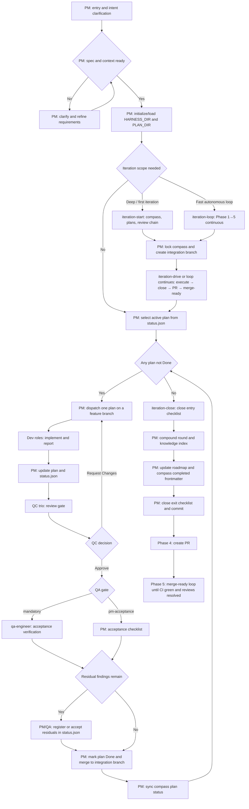

<div align="center">


# Morning Star

Code Agent Harness Framework

English / [中文](README_CN.md)

<a href="https://github.com/btspoony/mstar-harness">GitHub</a> · <a href="https://github.com/btspoony/mstar-harness/issues">Issues</a>

[](https://github.com/btspoony/mstar-harness/actions/workflows/ci.yml)
[](LICENSE)
[](https://github.com/btspoony/mstar-harness/releases)
[](https://github.com/btspoony/mstar-harness/commits/main)
[](https://www.npmjs.com/package/@mstar-harness/cli)

</div>

**Morning Star** is a multi-agent code harness for AI coding hosts.

- Start a usable multi-role workflow quickly
- Run with unified `mstar-*` skills instead of scattered rules
- Reuse one core process across OpenCode, Cursor, Codex, Kimi Code, ZCode, and omp
- **Recommended host order** (best → usable): **omp ≥ OpenCode ≥ Cursor > Kimi = ZCode > Codex** — omp/OpenCode/Cursor have the richest subagent + Plan UX; Kimi/ZCode work with built-in agent types only; Codex has the most constrained dispatch surface.
Release notes: [CHANGELOG.md](CHANGELOG.md) / [CHANGELOG_CN.md](CHANGELOG_CN.md).

## Install

```bash
npx @mstar-harness/cli init
# or: bunx @mstar-harness/cli init
```

| Host | Command |
|------|---------|
| OpenCode | `npx @mstar-harness/cli init --target opencode` |
| Cursor | `npx @mstar-harness/cli init --target cursor` |
| Codex | `npx @mstar-harness/cli init --target codex` then `codex plugin add morning-star-harness --marketplace personal` |
| Kimi | Kimi TUI: `/plugins install https://github.com/btspoony/mstar-harness` → `/plugins reload` |
| ZCode | `npx @mstar-harness/cli init --target zcode` then install **morning-star-harness** in ZCode → Settings → Plugin Management |
| omp | `npx @mstar-harness/cli init --target omp` (links `~/.mstar/harness`) or `omp plugin install github:btspoony/mstar-harness` |

Verify: `npx @mstar-harness/cli doctor --target <opencode\|cursor\|codex\|zcode\|omp>`.

Manual install / path layout: [`INSTALL.md`](INSTALL.md). CLI flags: [`docs/cli.md`](docs/cli.md).

Reload the host after install (OpenCode restart / Cursor **Developer: Reload Window** / reopen Codex / Kimi `/plugins reload` or `/new` / ZCode reload plugin / omp new session or `/reload-plugins` if available).

## Use

Three entry shapes: **codebase audit** (discover what to do), **without iteration** (single plan / hotfix), or **with iteration** (multi-plan Phase 1–5).

### Codebase audit

| Path | When |
|------|------|
| `/codebase-audit` | Survey a repo read-only → prioritized, self-contained improvement plans in `{PLAN_DIR}/audit-<date>/` |

Read-only advisory — never edits source. Output feeds iteration-start Research or normal Prepare → Execute. Effort levels: `quick` / `standard` (default) / `deep`; category focus (`security`, `perf`, `tests`, …) or `branch` / `next` variants. SSOT → `mstar-audit`.

### Without iteration

Enter PM, then run the per-plan cycle: `Prepare → Execute → QC → QA gate → Done`.

| Host | Enter PM |
|------|----------|
| OpenCode | `agent.project-manager` (`agents/project-manager.md`) |
| Cursor | `/pm` |
| Codex | `/pm` |
| Kimi | session auto-loads `pm`; or `/skill:pm` |
| ZCode | `/morning-star-harness:pm` each session (no auto-load) |
| omp | `/skill:pm` each session (no auto-load) |

Host limits (Kimi/ZCode/omp subagent surfaces, role binding in prompt): `mstar-host/references/kimi.md`, `mstar-host/references/zcode.md`, `mstar-host/references/omp.md`.

### With iteration

| Path | When |
|------|------|
| `/iteration-start` → `/iteration-drive` | First iteration, or need human direction lock before execute |
| `/iteration-loop` | Full Phase 1→5 with minimal check-ins (optional `direction`, `scale` S\|M\|L\|XL) |

### Command loading

| Host | How commands load |
|------|-------------------|
| Cursor / OpenCode | Bundled from `commands/` (OpenCode: plugin `harness-commands/`) |
| Codex project | `.agents/skills/<name>/SKILL.md` (CLI symlinks from `commands/`) |
| Codex global | Project-scoped commands **not** installed — use `--scope project` |
| Kimi / ZCode | `/morning-star-harness:iteration-start` · `:codebase-audit` (etc.) via plugin manifest |
| omp | `/iteration-start` · `/iteration-drive` · `/iteration-loop` · `/codebase-audit` (filename commands from plugin `commands/`) |

Phase 2 defaults: per-plan worktree + lease, `Findings cleanup: zero-residual`. Override only with explicit `Worktree mode: waived` / `Findings cleanup: allow-residual`. SSOT → `mstar-iteration`, `mstar-branch-worktree`, `mstar-plan-artifacts`.

Project knowledge bootstrap: `mstar-compound-refresh` → `references/project-knowledge-bootstrap.md`.

## Harness Workflow


```mermaid
flowchart TD
    A["PM: entry and intent clarification"] --> B{"PM: spec and context ready"}
    B -->|No| C["PM: clarify and refine requirements"]
    C --> B
    B -->|Yes| D["PM: initialize/load HARNESS_DIR and PLAN_DIR"]
    D --> E{"Iteration scope needed"}
    E -->|Deep / first iteration| F["iteration-start: compass, plans, review chain"]
    E -->|Fast autonomous loop| F2["iteration-loop: Phase 1→5 continuous"]
    F --> G["PM: lock compass and create integration branch"]
    F2 --> G
    G --> H["iteration-drive or loop continues: execute → close → PR → merge-ready"]
    E -->|No| I["PM: select active plan from status.json"]
    H --> I
    I --> J{"Any plan not Done"}
    J -->|Yes| K["PM: dispatch one plan on a feature branch"]
    K --> L["Dev roles: implement and report"]
    L --> M["PM: update plan and status.json"]
    M --> N["QC trio: review gate"]
    N --> O{"QC decision"}
    O -->|Request Changes| K
    O -->|Approve| P{"QA gate"}
    P -->|mandatory| P1["qa-engineer: acceptance verification"]
    P -->|pm-acceptance| P2["PM: acceptance checklist"]
    P1 --> Q{"Residual findings remain"}
    P2 --> Q
    Q -->|Yes| R["PM/QA: register or accept residuals in status.json"]
    R --> S["PM: mark plan Done and merge to integration branch"]
    Q -->|No| S
    S --> T["PM: sync compass plan status"]
    T --> J
    J -->|No| U["iteration-close: close entry checklist"]
    U --> V["PM: compound round and knowledge index"]
    V --> W["PM: update roadmap and compass completed frontmatter"]
    W --> X["PM: close exit checklist and commit"]
    X --> Y["Phase 4: create PR"]
    Y --> Z["Phase 5: merge-ready loop until CI green and reviews resolved"]
```

Without iteration: same per-plan gates, no `iteration-start` / `iteration-close` wrapper.

## Roles and skills

| Agent ID | Responsibility |
|----------|----------------|
| `project-manager` | Routing, assignment, phase progression |
| `product-manager` | Requirements, product planning, research |
| `architect` | Architecture and technical contracts |
| `fullstack-dev` / `fullstack-dev-2` | Backend-led implement / second parallel track |
| `frontend-dev` | UI, interaction, frontend performance |
| `qa-engineer` | Acceptance when `QA gate: mandatory` |
| `qc-specialist` / `-2` / `-3` | QC trio |
| `ops-engineer` | Deploy, monitoring, infrastructure |
| `writing-specialist` | Docs, fiction, copy, scripts |
| `prompt-engineer` | Prompt / skill / rule work |

Load **`mstar-harness-core` first**, then topic skills on demand (`mstar-roles`).

| Skill | Purpose |
|-------|---------|
| `mstar-harness-core` | Entry, state machine, Task category, skill index |
| `mstar-phase-gates` | Prepare/Execute, clarify, hotfix |
| `mstar-iteration` | Phase 1–5 iteration lifecycle |
| `mstar-dispatch-gates` | Dispatch, Delegation, anti-recursion |
| `mstar-sdd` | Subagent-driven development |
| `mstar-branch-worktree` | Branches, worktrees, QC/QA checkout |
| `mstar-plan-conventions` | `{HARNESS_DIR}` discovery / init |
| `mstar-plan-artifacts` | Plans, `status.json`, residuals, Findings cleanup |
| `mstar-design-md` | DESIGN.md gate for UI plans |
| `mstar-review-qc` | PM QC tri orchestration |
| `mstar-coding-behavior` | RCA, test-first, review feedback, evidence |
| `mstar-compound` / `mstar-compound-refresh` | Knowledge crystallize / maintain |
| `mstar-strategy` | `STRATEGY.md` alignment |
| `mstar-skill-authoring` | Skill authoring contracts |
| `mstar-audit` | Read-only codebase audit → prioritized improvement plans |
| `mstar-roles` | Role prompts + load lists |
| `mstar-host` | Host adapters (OpenCode / Cursor / Codex / Kimi / ZCode / omp) |
| `pm` | `/pm` / `/skill:pm` / host PM entry |

Consumer plans default to **`.mstar/`**. Process artifacts (`plans/`, `iterations/`, `status.json`, `sdd/`, …) are gitignored; tracked results: `{HARNESS_DIR}/AGENTS.md`, `knowledge/`, `specs/`. Specs resolve `.mstar/specs/` → `docs/specs/` → repo-root `specs/`. Details → `mstar-plan-conventions`.

Maintainers: [`AGENTS.md`](AGENTS.md).

## License

MIT. See [LICENSE](./LICENSE).
