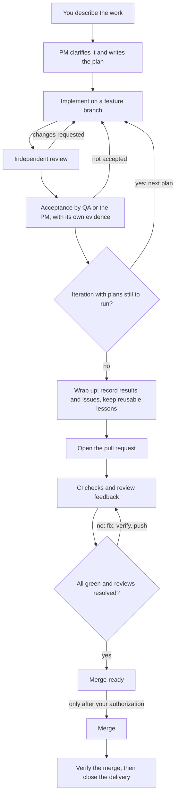

<div align="center">


# [Morning Star](https://github.com/btspoony/mstar-harness)

Harness Workflow Engine · Agent Plugin

English / [中文](README_CN.md)

<a href="https://github.com/btspoony/mstar-harness">GitHub</a> · <a href="https://github.com/btspoony/mstar-harness/issues">Issues</a>

[](https://github.com/btspoony/mstar-harness/actions/workflows/ci.yml)
[](LICENSE)
[](https://github.com/btspoony/mstar-harness/releases) [](INSTALL.md#prerequisites)
[](https://github.com/btspoony/mstar-harness/commits/main)
[](https://dshfind.com/zh/plugins/btspoony/mstar-harness?ref=badge)
[](https://www.greptile.com/?utm_source=oss_badge&utm_medium=readme&utm_campaign=greptile_for_open_source)

[](https://www.npmjs.com/package/@mstar-harness/cli)
[](https://www.npmjs.com/package/@mstar-harness/dsh)
[](https://www.npmjs.com/package/@mstar-harness/omp)
[](https://www.npmjs.com/package/@mstar-harness/opencode)

</div>

Morning Star brings a delivery process to the AI coding tools you already use — dsh, omp, OpenCode, Cursor, Kimi Code, ZCode, and Codex. You describe what you want; a `project-manager` agent clarifies the request, keeps a plan, and carries the work from requirements through implementation, review, and acceptance to a pull request. Requirements, architecture, implementation, review, acceptance, and audits each go to a role that owns that part.

**Why use it**

- **From request to pull request** — describe the work once; the PM keeps the plan, brings in the right specialists, and drives everything to a pull request. If work stops partway, the plan records where it left off so the work can resume later.
- **Specialists instead of one long prompt** — a PM orchestrates; separate roles own requirements, architecture, implementation, QC, acceptance, audits, and ops, each with a narrow brief.
- **A trail you can audit** — plans, findings, review reports, and decisions are recorded under the harness directory in your repo, not just in the chat.
- **Boundaries are explicit** — the workflow opens pull requests and stops at merge-ready; merging stays your call. Audits read and report, and anything that touches a real environment needs your explicit authorization.
- **Deterministic gates, enforced by a TS engine** — path/status/lease/dispatch/sdd/iteration/lint gates run in `@mstar-harness/engine`, not as prompt suggestions
- **Judgment stays in `mstar-*` skills** — skills remain the single source of truth (SSOT) for roles, gates, and workflow judgment
- **One engine across hosts** — the same engine + skills power dsh (DeepSeek Harness), omp, OpenCode, Cursor, Kimi Code, ZCode, and Codex
- **Agent Plugin packaging** — one-command install; portable across any Agent Plugins v1.0.0 client
- **Pluggable JSON persistence (review documents)** — review envelopes and unrelated generic JSON persist through an `ArtifactStore`; the default `FsStore` keeps the existing `.mstar/` paths, and integrations mount their own store via `MSTAR_STORE_MODULE` / `--store` / in-process `setArtifactStore`. Execution state is never stored this way
- **Store authority** — `{HARNESS_DIR}/store.db` (SQLite) is the issue, catalog, roadmap, and workflow/plan execution authority once created (`mstar store init`, or `mstar store upgrade` for historical file state); `status.json` and workflow snapshots are migration staging written only by that migration tooling, the retired project registers are migration history with no write path, and open items are issues in the store. A workspace without a store has no execution authority — track the work in conversation (no-plan mode)
- **Recommended host** (best → usable): **dsh = omp ≥ ZCode = OpenCode = Cursor > Kimi > Codex**

## Install

| Host | Install |
|------|---------|
| dsh (DeepSeek Harness) | `npx @mstar-harness/cli init --target dsh` — needs the `dsh` CLI on `PATH`; installs the plugin plus LLM fallbacks (`--no-fallbacks` skips the second) |
| omp | `npx @mstar-harness/cli init --target omp` — needs the `omp` CLI installed |
| OpenCode | `npx @mstar-harness/cli init --target opencode` — probes the installed `opencode` version: 1.x installs `@mstar-harness/opencode`, 2.x installs `@mstar-harness/opencode-v2` (override with `--opencode-generation`) |
| Cursor | `npx @mstar-harness/cli init --target cursor` — creates a real plugin checkout, so `git` is required |
| Kimi Code | Kimi TUI: `/plugins install https://github.com/btspoony/mstar-harness`, then `/plugins reload` |
| ZCode | `npx @mstar-harness/cli init --target zcode`, then install **morning-star-harness** from Settings → Plugin Management |
| Codex | `npx @mstar-harness/cli init --target codex` — needs the `codex` CLI; registers the repo marketplace and adds `morning-star-harness@mstar-repo` |

`init` defaults to `--scope project` (`--scope global` installs host-wide, and Codex's global scope skips the seven slash-command skills; for dsh the flag has no effect — its profile is machine-global), and after a successful run it installs the matching `@mstar-harness/cli` version globally — pass `--no-global-cli` to skip that. Check the result with `npx @mstar-harness/cli doctor --target <host>`; it also reports MCP configuration as `aligned`, `mismatch`, or `unavailable`.

The published binary is `mstar-harness`. The short alias `mstar` exists only where this package is installed, and an unrelated npm package claims the same name — use the long form when in doubt. Manual installs, path layout, and host notes: [`INSTALL.md`](INSTALL.md).

## Use

Enter the PM once per session, then describe the work in your own words; the PM runs the process in that session.

| Host | Enter PM |
|------|----------|
| dsh | `pm` skill |
| omp | `/skill:pm` |
| OpenCode | `Project Manager` agent, or `/pm` |
| Cursor | `/pm` |
| Kimi Code | auto-loads in a session, or `/skill:pm` |
| ZCode | `/morning-star-harness:pm` |
| Codex | `/pm` |

### Single task (no iteration)

Give the PM a concrete request — for example, *"Add rate limiting to the public API and cover it with tests."* The PM clarifies the gaps, writes a plan, runs the work on a feature branch, and drives it through implement → independent QC review → acceptance → done. Confirmed problems that are not fixed in this round are captured as issues instead of being dropped. You review the result and merge.

### Iteration

| Command | When |
|---------|------|
| `/iteration-start [direction] [pause]` | Phase 1: an interactive direction lock (grill-me) that produces the iteration's compass and plans, then continues automatically through execution, close, pull request, and merge-ready. `pause` stops after Phase 1; continue with `/iteration-drive`. |
| `/iteration-drive` | Resume or advance an already locked iteration. Takes no arguments. |
| `/iteration-loop [direction] [scale]` | The same lifecycle end to end without the interactive phase. `scale` (`S` / `M` / `L` / `XL`) caps how many plans the iteration takes on. |

An iteration ends only after its post-merge close: a closed phase, an open pull request, or a merged pull request is not completion by itself. Command spelling differs per host — some hosts require a plugin prefix, and Codex installs the command skills at project scope only; argument forms and per-host details are in [`docs/commands.md`](docs/commands.md).

### Audit, review & verification

| Command | When |
|---------|------|
| `/codebase-audit [keywords]` | Read-only survey that produces prioritized, ready-to-execute improvement plans; narrow it with a category focus (`bug`, `security`, `perf`, `tech-debt`, …). |
| `/amazing-pr-review [pr\|branch] [quick\|default\|deep]` | Pre-merge review of a PR or branch at three strengths, ending in one verdict — `ship it`, `needs fixes`, or `blocked`. |
| `/amazing-test-audit [scope] [quick\|deep] [campaign]` | Read-only audit of the test surface → plans to delete, repair, consolidate, or relocate tests. |
| `/amazing-e2e-check [environment] [scenarios]` | Runs browser, device, or installed-deployment scenarios you explicitly asked for, in a separate workflow. |

The audit commands read and report; they do not edit your code. Two boundaries to know: `/amazing-pr-review` posts its findings to GitHub as a comment review when you give it a pull-request number — it never approves, requests changes, or merges — and `/amazing-e2e-check` runs only when you ask for it, with steps that touch a real environment requiring explicit authorization.

## Workflow


```mermaid
flowchart TD
    A["You describe the work"] --> B["PM clarifies it and writes the plan"]
    B --> C["Implement on a feature branch"]
    C --> D["Independent review"]
    D -->|changes requested| C
    D --> E["Acceptance by QA or the PM, with its own evidence"]
    E -->|not accepted| C
    E --> F{"Iteration with plans still to run?"}
    F -->|yes: next plan| C
    F -->|no| G["Wrap up: record results and issues, keep reusable lessons"]
    G --> H["Open the pull request"]
    H --> I["CI checks and review feedback"]
    I --> J{"All green and reviews resolved?"}
    J -->|no: fix, verify, push| I
    J -->|yes| K["Merge-ready"]
    K -->|only after your authorization| L["Merge"]
    L --> M["Verify the merge, then close the delivery"]
```

The main path shows a **development** delivery. Every plan gets a plan-level QC review — three independent seats by default — and a multi-task plan adds a per-task review during implementation. A hotfix — or a plan explicitly set to run inline — takes a lighter route with fewer review seats. Acceptance is a separate pass with its own evidence — QA or the PM — not a re-read of the implementer's summary, and confirmed problems that this round does not fix become tracked issues instead of being dropped.

**Scope notes.** An iteration locks its direction with you first, then runs the per-plan cycle for every plan it takes on and closes out once before its pull request; without an iteration, the cycle runs for a single plan. A verification or report-only deliverable — an audit, for example — ends at its agreed completion, with no pull request or merge. On the development path, a plan is complete only with its evidence: plan completion, merge-ready, and merged are three different facts, and only a verified merge, followed by the post-merge close, ends the delivery. Merging is a separate authorization — request it explicitly, or merge yourself — and branch cleanup stays a separate, explicit step.

The engine checks the mechanically checkable parts of this process — workflow state transitions, branch and worktree alignment, dispatch preconditions, plan and issue bookkeeping. These checks are advisory by default: they report problems, and a project or iteration can opt into blocking enforcement with `enforcement: hard`; whether a violation can actually block depends on the host. Process state (plans, workflow records, findings, review reports) lives in the harness directory, `.mstar/` by default, which is gitignored.

## Dashboard

A read-only page on `127.0.0.1`, for this machine only, that brings project progress, open issues, and the roadmap into one view for the repository you start it from. It has Issues, Workflows, Iterations, and Roadmap; on Issues you can search and filter, open an issue's recorded history, and read the issue flow — a cumulative trend of issues captured versus retired. Nothing on the page writes; changes go through the CLI.

```text
mstar-harness dashboard
```

The command prints a one-line JSON result. Open `data.url` (`http://127.0.0.1:` plus the port it actually bound) and press Ctrl-C to stop. `--port` and `--project <projectId>` are optional; omit `--port` and the OS chooses. The page does not push live updates.

Details: [`docs/runtime-reference.md`](docs/runtime-reference.md#cli-contract).

## MCP

From a coding tool that supports MCP, look up issues, the roadmap, and workflows, and run the matching CLI operations and checks, without writing a shell command. `mstar-harness mcp` is the stdio server in this package. It follows the same rules as the CLI — not a new permission — and there is no separate MCP package.

After install, a host usually already has its launch configuration; see [`INSTALL.md`](INSTALL.md#installing-the-mcp-tools). Static JSON configs use the shape below (`npx` needs Bun on `PATH`, as in [Prerequisites](INSTALL.md#prerequisites)). Do not paste it over a file the host already wrote. OpenCode does not read a static file — its plugin injects the server from the `config` hook. dsh is the exception: the shipped row stays inert until the profile includes `@deepseek-ai/dsh-mcp-client` (`dsh plugin --profile web add @deepseek-ai/dsh-mcp-client`).

```json
{
  "mcpServers": {
    "morning-star": {
      "command": "npx",
      "args": ["@mstar-harness/cli", "mcp"]
    }
  }
}
```

Further detail: [`docs/runtime-reference.md`](docs/runtime-reference.md#mcp).

## Roles and skills

| Agent ID | Responsibility |
|----------|----------------|
| `project-manager` | Routing, assignment, phase progression |
| `product-manager` | Requirements, product planning, research |
| `architect` | Architecture and technical contracts |
| `fullstack-dev` / `fullstack-dev-2` | Backend-led implement / second parallel track |
| `frontend-dev` | UI, interaction, frontend performance |
| `qa-engineer` | Acceptance when `QA gate: mandatory` |
| `code-reviewer` | SDD per-task review; codebase audit (`audit` category) |
| `qc-specialist` / `-2` / `-3` | QC trio |
| `ops-engineer` | Deploy, monitoring, infrastructure |
| `writing-specialist` | Docs, fiction, copy, scripts |
| `prompt-engineer` | Prompt / skill / rule work |

A **project-manager** runs your session and dispatches the work: requirements and architecture, backend and frontend implementation, QC review, acceptance, codebase and PR audits, operations, and writing each go to a dedicated role. Every role follows the `mstar-*` skills.

## Command line

The `mstar-harness` CLI covers what you do outside a session: issues, roadmap, workflow state, checks, the dashboard, and MCP.

- **Ask the command itself.** `--help` shows the input a command expects; for issue write verbs it lists each payload field with its type and whether it is required or only required for a particular disposition. A usage refusal tells you what it found wrong, the help route to read, and how to recover.

```text
mstar-harness --help                        # command families
mstar-harness issue close --help            # options and payload fields for one verb
mstar-harness schema --command issue.close  # the same contract as machine-readable JSON
```

- `mstar-harness report` drafts an offline, redacted GitHub issue report for you to review before posting.

Host wiring, the issue and roadmap command families, and the details behind these surfaces are in [`docs/runtime-reference.md`](docs/runtime-reference.md).

## Documentation

- [`docs/runtime-reference.md`](docs/runtime-reference.md) — components, storage layout, roles and skills, CLI and MCP reference.
- [`INSTALL.md`](INSTALL.md) — install and verification per host, plus the `report` command in detail.
- [`docs/commands.md`](docs/commands.md) — the seven slash commands: arguments, when to use, owning skill.
- [`CONCEPTS.md`](CONCEPTS.md) — the vocabulary the harness uses across skills and docs.
- Release notes: [`CHANGELOG.md`](CHANGELOG.md) / [`CHANGELOG_CN.md`](CHANGELOG_CN.md). CLI flags: the **`mstar-use-cli`** skill.
- Maintainers: [`AGENTS.md`](AGENTS.md).

## License

MIT. See [LICENSE](./LICENSE).
