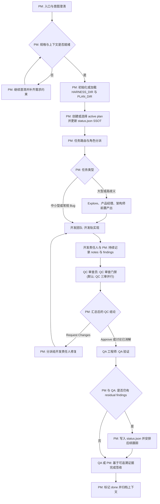

<div align="center">

### Morning Star (启明星) — 编码智能体 Harness 框架

[English](README.md) / 中文

<a href="https://github.com/btspoony/mstar-harness">GitHub</a> · <a href="https://github.com/btspoony/mstar-harness/issues">Issues</a>

[](https://github.com/btspoony/mstar-harness/blob/main/LICENSE)
[](https://github.com/btspoony/mstar-harness/commits/main)

</div>

本项目为 **Morning Star / 启明星** 的多角色 code agent harness框架。

你能获得的核心价值：

- 快速启动一套可用的多角色协作流
- 通过统一的 `mstar-*` skills 执行，而不是散落规则
- 在 OpenCode / Cursor / Codex 下复用同一套核心流程

## 快速开始（推荐方式）

### CLI Install

- 使用 `mstar-harness` CLI（npm 包名 `@mstar-harness/cli`）：
  - `npx @mstar-harness/cli init`
  - 或 `bunx @mstar-harness/cli init`
- `init` 提供按 target 的引导式安装流程，将安装与基础配置一步完成。
- CLI 当前支持的 target：
  - `opencode`
  - `cursor`

完整 CLI 用法和高级参数（`--yes`、`--dry-run`、`--output`、`doctor`），以及 Cursor target 的安装模式说明，见 [`docs/cli.md`](docs/cli.md)。

### Manual Install

当前支持手动安装的 target：

- `opencode`
- `cursor`
- `codex`

#### OpenCode

- 推荐使用 plugin 安装：
  - 在 `opencode.json` 增加插件配置：
    ```json
    {
      "$schema": "https://opencode.ai/config.json",
      "plugin": [
        "superpowers@git+https://github.com/obra/superpowers.git",
        "@mstar-harness/opencode@latest"
      ]
    }
    ```
  - 重启 OpenCode
- OpenCode 插件**只从 `@mstar-harness/opencode` 包内路径**解析 skills/agents（**不**依赖 `process.cwd()`）。发布包内含 `harness-skills/`、`harness-agents/`。若在本仓库 **git 工作区**开发，请在**仓库根**执行 **`bun install` / `npm install`**，以便 `postinstall` 执行 `opencode:bundle-assets`，在 `packages/opencode/` 下生成上述目录。

OpenCode 的详细安装与迁移说明见 `packages/opencode/INSTALL.md`。

#### Cursor

- 本地插件安装（直接 clone）：
  - `mkdir -p ~/.cursor/plugins/local`
  - `git clone https://github.com/btspoony/mstar-harness.git ~/.cursor/plugins/local/mstar-harness`
  - 重启 Cursor 或运行 `Developer: Reload Window`

#### Codex

- Marketplace 安装：
  - `codex plugin marketplace add https://github.com/btspoony/mstar-harness.git --sparse .codex/`
  - 从新增的 marketplace 中安装 **Morning Star Harness**。

## 使用方式

- **OpenCode**：以 `Project Manager` 角色开局（对应 `agents/project-manager.md`，通常是 `opencode.json` 里的 `agent.project-manager`）。
- **Cursor**：使用 `/pm` 强制以 `Project Manager` 角色启动。
- **Codex**：安装插件后，使用 `/pm` 强制以 `Project Manager` 角色启动。

## 角色与技能总览

### 角色分工（Who does what）

| Agent ID | 角色 | 主要职责 |
|----------|------|---------|
| `project-manager` | 项目经理 | 路由、分派、阶段推进 |
| `product-manager` | 产品经理 | 需求、产品规划与市场/用户研究 |
| `architect` | 架构师 | 架构与技术契约 |
| `fullstack-dev` / `fullstack-dev-2` | 全栈开发 | 后端主导实现 / 第二并行轨 |
| `frontend-dev` | 前端开发 | UI、交互、前端性能 |
| `qa-engineer` | QA | 测试与验收验证 |
| `qc-specialist` / `qc-specialist-2` / `qc-specialist-3` | QC 三审 | 代码质量门禁（架构/安全/性能） |
| `ops-engineer` | 运维 | 部署、监控、基础设施 |
| `writing-specialist` | 写作专家 | 文档写作、小说写作、文案写作与脚本写作 |
| `prompt-engineer` | 提示词工程师 | prompt / skill / rule 优化 |

你可以在 `opencode.json` 中为每个角色指定不同的模型（以及模型供应商）。

### 核心技能（What drives behavior）

| Skill | 作用 |
|-------|------|
| `mstar-harness-core` | 全局入口、状态机、门禁与不变量 |
| `mstar-plan-conventions` | plan / status / residual 的统一约定 |
| `mstar-review-qc` | QC 审查标准与报告模板 |
| `mstar-coding-behavior` | 通用编码行为基线 |
| `mstar-superpowers-align` | 与 Superpowers 的对齐与冲突消解 |
| `mstar-roles` | 角色提示词总线（角色正文在 `references/`） |
| `mstar-host`（按宿主） | 宿主能力差异（OpenCode / Cursor） |
| `pm` | Cursor 与 Codex 共享的 `/pm` 强制入口 |

## Harness Workflow（统一流程）



### Plan 初始化模板

启用 plan 管理时，可将本仓库 [`skills/mstar-plan-conventions/templates/`](./skills/mstar-plan-conventions/templates/) 下的空文件复制到 `{HARNESS_DIR}`（常见为 `.agents/`）：`status.empty.json` → `status.json`；可选 `notes.empty.json` → `notes.json`。residual 的 canonical 与 legacy fallback **只在** [`skills/mstar-plan-conventions/SKILL.md`](./skills/mstar-plan-conventions/SKILL.md) **开篇**定义一次。另见 [`skills/mstar-plan-conventions/templates/README.md`](./skills/mstar-plan-conventions/templates/README.md)。

## 许可

本项目采用 MIT License，详见 [LICENSE](./LICENSE)。
