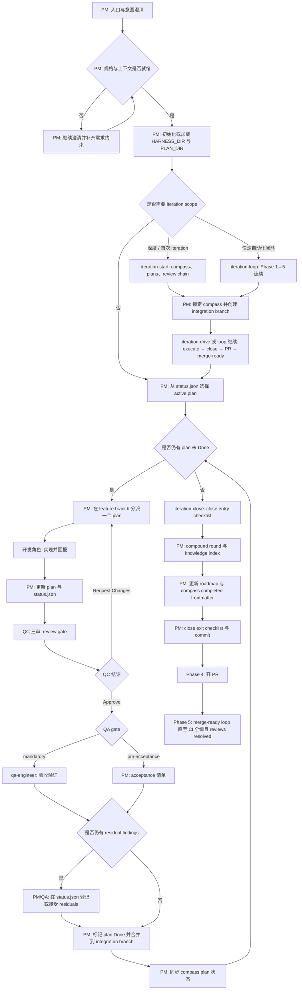

<div align="center">


# Morning Star (启明星)

编码智能体 Harness 框架

[English](README.md) / 中文

<a href="https://github.com/btspoony/mstar-harness">GitHub</a> · <a href="https://github.com/btspoony/mstar-harness/issues">Issues</a>

[](https://github.com/btspoony/mstar-harness/blob/main/LICENSE)
[](https://github.com/btspoony/mstar-harness/commits/main)

</div>

本项目为 **Morning Star / 启明星** 的多角色 code agent harness框架。

你能获得的核心价值：

- 快速启动一套可用的多角色协作流
- 通过统一的 `mstar-*` skills 执行，而不是散落规则
- 在 OpenCode / Cursor / Codex / Kimi Code 下复用同一套核心流程

当前版本：**1.5.2** — 详见 [CHANGELOG.md](CHANGELOG.md) / [CHANGELOG_CN.md](CHANGELOG_CN.md)。

## 快速开始（推荐方式）

推荐使用 CLI（`@mstar-harness/cli`）安装：

```bash
npx @mstar-harness/cli init
# 或：bunx @mstar-harness/cli init
```

按 target 示例：

- OpenCode：`npx @mstar-harness/cli init --target opencode`
- Cursor：`npx @mstar-harness/cli init --target cursor`
- Codex：`npx @mstar-harness/cli init --target codex`，然后 `codex plugin add morning-star-harness --marketplace personal`
- Kimi：在 Kimi TUI 执行 `/plugins install https://github.com/btspoony/mstar-harness`，然后 `/plugins reload`

`init` 提供按 target 的引导式安装（scope、路径布局、基础配置）。可用 `npx @mstar-harness/cli doctor --target <opencode|cursor|codex>` 校验。

**详细安装**（手动步骤、路径布局、Codex project vs global）：[`INSTALL.md`](INSTALL.md)。**CLI 参数与高级选项：** [`docs/cli.md`](docs/cli.md)。

## 使用方式

- **OpenCode**：以 `Project Manager` 角色开局（对应 `agents/project-manager.md`，通常是 `opencode.json` 里的 `agent.project-manager`）。
- **Cursor**：使用 `/pm` 强制以 `Project Manager` 角色启动。
- **Codex**：安装插件后使用 `/pm`。CLI 或手动安装会链接 `codex/agents/` 下的 custom agents。
- **Kimi**：安装插件（`.kimi-plugin/plugin.json`）；新会话通过 `sessionStart` 自动加载 **`pm`**。随时可用 `/skill:pm`。内置子 agent 仅 `coder` / `explore` / `plan` — 角色绑定写在 Agent prompt 中（见 `mstar-host/references/kimi.md`）。

### Harness Commands

三个由 PM 驱动的 iteration 入口。按你需要的人工参与程度选择：

| 路径 | 适用场景 | 流程 |
|------|----------|------|
| `/iteration-start` → `/iteration-drive` | 首次 iteration，或需要人工方向锁定（**grill-me**）的深度工作 | 仅 Phase 1 → Phase 2–5（执行、收尾、开 PR、merge-ready） |
| `/iteration-loop` | 快速自动化完整闭环（适合 cloud agent）；可选 `direction` + `scale`（S\|M\|L） | Phase 1→5 连续执行，尽量少人工确认 |

**Phase 2 默认**（iteration 执行；仅当 Assignment 显式 `Worktree mode: waived` 时可豁免）：

- 在 `spec_integration_branch` 上使用 **control worktree**；`status.json` 与 SDD 以该检出路径为 SSOT。
- 每个 plan 在可写 implement 派发前须具备独立 **feature worktree** + `execution_lease`。
- 不同 plan 可在多 session 下并行 implement（各自 lease）；合并回 integration 分支仍须**串行**。
- `Plan parallelism: serial` 仅约束 implement 调度波次，**不**豁免 worktree / lease 闸。

细则 → `mstar-iteration`（`references/phase-2-worktree-lease.md`）与 `mstar-branch-worktree`。

**命令加载位置：**

| 宿主 | 发现方式 |
|------|----------|
| **Cursor / OpenCode** | 从本仓库 `commands/` 打包（OpenCode：插件内 `harness-commands/`） |
| **Codex（project 安装）** | 同上三条命令作为项目本地 skill：`.agents/skills/<name>/SKILL.md`（CLI 从 `commands/` 软链接） |
| **Codex（global 安装）** | **不**安装 iteration skills — 使用 `--scope project` 以免污染其他项目 |
| **Kimi（插件）** | 通过 `.kimi-plugin/plugin.json` 的 `/morning-star-harness:iteration-start` 等命令 |

项目知识脚手架的初始化/刷新：通过 `mstar-compound-refresh` skill（`references/project-knowledge-bootstrap.md`）。

安装后请重载宿主（重启 OpenCode / Cursor **Developer: Reload Window** / 重新打开 Codex / Kimi `/plugins reload` 或 `/new`）。

## Harness Workflow（统一流程）



单 plan 或非 iteration 工作使用同一套 per-plan gate（`Prepare → Execute → QC → QA gate → Done`），但不需要 iteration-start / iteration-close 外层。

## 角色与技能总览

### 角色分工（Who does what）

| Agent ID | 角色 | 主要职责 |
|----------|------|---------|
| `project-manager` | 项目经理 | 路由、分派、阶段推进 |
| `product-manager` | 产品经理 | 需求、产品规划与市场/用户研究 |
| `architect` | 架构师 | 架构与技术契约 |
| `fullstack-dev` / `fullstack-dev-2` | 全栈开发 | 后端主导实现 / 第二并行轨 |
| `frontend-dev` | 前端开发 | UI、交互、前端性能 |
| `qa-engineer` | QA | 分级验收（`QA gate: mandatory` 时派发；否则 PM acceptance） |
| `qc-specialist` / `qc-specialist-2` / `qc-specialist-3` | QC 三审 | 代码质量门禁（架构/安全/性能） |
| `ops-engineer` | 运维 | 部署、监控、基础设施 |
| `writing-specialist` | 写作专家 | 文档写作、小说写作、文案写作与脚本写作 |
| `prompt-engineer` | 提示词工程师 | prompt / skill / rule 优化 |

你可以在 `opencode.json` 中为每个角色指定不同的模型（以及模型供应商）。

### 核心技能（What drives behavior）

先读 **`mstar-harness-core`**，再按角色与任务 **按需** 加载专题 skill（详见 `mstar-roles` 各角色必读清单）。

| Skill | 作用 |
|-------|------|
| `mstar-harness-core` | 全局入口、状态机、Task category、skill 索引 |
| `mstar-phase-gates` | Prepare/Execute 门禁、clarify、hotfix |
| `mstar-iteration` | 迭代生命周期：Phase 1–5（start、execute loop、iteration-close、PR 交付、merge-ready loop） |
| `mstar-dispatch-gates` | PM 派发、Delegation、反递归、并行 invoke |
| `mstar-sdd` | 子代理驱动开发：文件交接、每 task 实现+审查、进度账本 |
| `mstar-branch-worktree` | 功能分支、worktree、QC/QA 检出对齐 |
| `mstar-plan-conventions` | `{HARNESS_DIR}` 发现、初始化、Spec 分支摘要 |
| `mstar-plan-artifacts` | 主 plan、review bundle / durable summary、`status.json`、residual、knowledge/iteration 索引、Done 归档 |
| `mstar-design-md` | UI 相关 plan 的 DESIGN.md 设计系统门禁 |
| `mstar-review-qc` | PM：QC tri 编排、residual 门禁、四层边界；leaf 执行 → `mstar-roles/references/qc-specialist/` |
| `mstar-coding-behavior` | 通用编码行为：RCA、测试优先检查、审查反馈、完成证据 |
| `mstar-compound` | 知识结晶，写入 `{KNOWLEDGE_DIR}` |
| `mstar-compound-refresh` | 知识维护：刷新、合并、归档或移除过期文档 |
| `mstar-strategy` | STRATEGY.md 长期方向与决策对齐 |
| `mstar-skill-authoring` | Skill 编写、触发契约、渐进披露与行为变更证据 |
| `mstar-roles` | 角色提示词总线 + 各角色 skill 加载清单 |
| `mstar-host` | 宿主适配（OpenCode / Cursor / Codex / Kimi）；自动识别 + `references/` |
| `pm` | Cursor、Codex、Kimi 共享的 `/pm` 或 `/skill:pm` 强制入口 |

维护者：仓库内维护笔记与计划约定见 [`AGENTS.md`](AGENTS.md)；这些本地产物不属于发布的 skill 树。

项目计划工件默认使用 **`.mstar/`**（`{HARNESS_DIR}`），同时继续识别既有 `.agents/` / `.plans/` / `plans/` 布局。

**Git 跟踪（默认）**：进程本地（`plans/`、`iterations/`、`status.json`、`sdd/` 等 gitignored）；结果共享（`{HARNESS_DIR}` 下 `AGENTS.md`、`knowledge/`、`specs/` 默认 tracked）。`{SPECS_DIR}` 解析顺序：`.mstar/specs/` → `docs/specs/` → 仓库根 `specs/`（空目录跳过；greenfield 创建 `.mstar/specs/`）。细则 → `mstar-plan-conventions`。

## 许可

本项目采用 MIT License，详见 [LICENSE](./LICENSE)。
