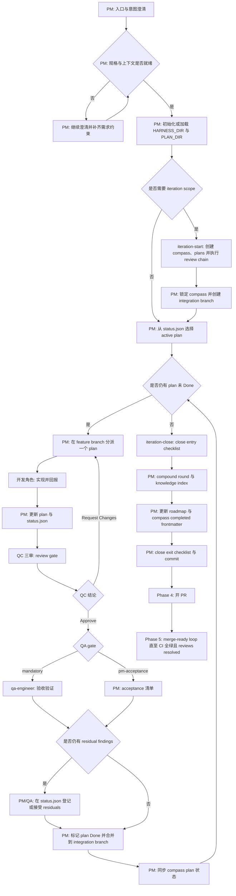

<div align="center">


# Morning Star (启明星)

编码智能体 Harness 框架

[English](README.md) / 中文

<a href="https://github.com/btspoony/mstar-harness">GitHub</a> · <a href="https://github.com/btspoony/mstar-harness/issues">Issues</a>

[](https://github.com/btspoony/mstar-harness/blob/main/LICENSE)
[](https://github.com/btspoony/mstar-harness/commits/main)

</div>

本项目为 **Morning Star / 启明星** 的多角色 code agent harness框架。

你能获得的核心价值：

- 快速启动一套可用的多角色协作流
- 通过统一的 `mstar-*` skills 执行，而不是散落规则
- 在 OpenCode / Cursor / Codex 下复用同一套核心流程

当前版本：**1.2.1** — 详见 [CHANGELOG.md](CHANGELOG.md) / [CHANGELOG_CN.md](CHANGELOG_CN.md)。

## 快速开始（推荐方式）

### CLI Install

- 使用 `mstar-harness` CLI（npm 包名 `@mstar-harness/cli`）：
  - `npx @mstar-harness/cli init`
  - 或 `bunx @mstar-harness/cli init`
- `init` 提供按 target 的引导式安装流程，将安装与基础配置一步完成。
- CLI 当前支持的 target：
  - OpenCode：`npx @mstar-harness/cli init --target opencode`
  - Cursor：`npx @mstar-harness/cli init --target cursor`
  - Codex：
    - `npx @mstar-harness/cli init --target codex`
    - `codex plugin add morning-star-harness --marketplace personal`
- Cursor 与 Codex 共享 `~/.mstar/harness` 长期 checkout（Codex marketplace 与 agent 源）。**Cursor** 在插件路径使用**独立的 git 实目录**——Cursor **无法发现**软链接形式的插件目录（见 [`docs/cli.md`](docs/cli.md#install-path-layout)）。

完整 CLI 用法和高级参数（`--yes`、`--dry-run`、`--output`、`doctor`），以及 Cursor / Codex target 的安装模式说明，见 [`docs/cli.md`](docs/cli.md)。

### Manual Install

当前支持手动安装的 target：

- `opencode`
- `cursor`
- `codex`

#### OpenCode

- 推荐使用 plugin 安装：
  - 在 `opencode.json` 增加插件配置：
    ```json
    {
      "$schema": "https://opencode.ai/config.json",
      "plugin": [
        "@mstar-harness/opencode@latest"
      ]
    }
    ```
  - 重启 OpenCode
- OpenCode 插件**只从 `@mstar-harness/opencode` 包内路径**解析 skills/agents（**不**依赖 `process.cwd()`）。发布包内含 `harness-skills/`、`harness-agents/`。若在本仓库 **git 工作区**开发，请在**仓库根**执行 **`bun install` / `npm install`**，以便 `postinstall` 执行 `opencode:bundle-assets`，在 `packages/opencode/` 下生成上述目录。

OpenCode 的详细安装与迁移说明见 `packages/opencode/INSTALL.md`。

#### Cursor

- 推荐：
  - `npx @mstar-harness/cli init --target cursor --scope global`
  - 重启 Cursor 或运行 `Developer: Reload Window`
- 手动安装（与 CLI 相同布局；Cursor 插件路径**不要用软链接**）：
  - `git clone https://github.com/btspoony/mstar-harness.git ~/.mstar/harness`
  - `mkdir -p ~/.cursor/plugins/local`
  - `git clone https://github.com/btspoony/mstar-harness.git ~/.cursor/plugins/local/morning-star-harness`
  - 重启 Cursor 或运行 `Developer: Reload Window`
- **维护者**：在 workspace 开发后，更新 Cursor 插件 checkout：
  - `cd ~/.cursor/plugins/local/morning-star-harness && git pull --ff-only`
  - 或重新运行 `npx @mstar-harness/cli init --target cursor --scope global`

#### Codex

- Personal marketplace 安装（不使用 CLI）：
  - clone 或更新长期本地 checkout：
    - `git clone https://github.com/btspoony/mstar-harness.git ~/.mstar/harness`
  - 创建或更新 `~/.agents/plugins/marketplace.json`：
    ```json
    {
      "name": "personal",
      "interface": {
        "displayName": "Personal"
      },
      "plugins": [
        {
          "name": "morning-star-harness",
          "source": {
            "source": "local",
            "path": "./.mstar/harness"
          },
          "policy": {
            "installation": "AVAILABLE",
            "authentication": "ON_INSTALL"
          },
          "category": "Productivity"
        }
      ]
    }
    ```
  - 安装插件：
    - `codex plugin add morning-star-harness --marketplace personal`
  - 链接 Codex custom agents：
    - `mkdir -p ~/.codex/agents`
    - `ln -s ~/.mstar/harness/codex/agents/*.toml ~/.codex/agents/`
- 本仓库也是 **Morning Star Harness Codex 插件源码**：
  - 插件 manifest：`.codex-plugin/plugin.json`
  - 运行时 skills：`skills/`
  - Codex custom agents：`codex/agents/`
  - Codex 运行时适配：`skills/mstar-host/references/codex.md`

## 使用方式

- **OpenCode**：以 `Project Manager` 角色开局（对应 `agents/project-manager.md`，通常是 `opencode.json` 里的 `agent.project-manager`）。
- **Cursor**：使用 `/pm` 强制以 `Project Manager` 角色启动。
- **Codex**：安装插件后，使用 `/pm` 强制以 `Project Manager` 角色启动。
  CLI / 手动安装链接 `codex/agents/` 后，Codex 可通过 custom agents 执行 Morning Star 角色派发。

### Harness Commands

共享的 `commands/` 目录目前提供这些由 PM 驱动的 harness commands：

| Command | 可用宿主 | 使用场景 |
|---------|----------|----------|
| `/mstar-bootstrap` | Cursor、OpenCode | 初始化或刷新项目知识脚手架：`STRATEGY.md`、`CONCEPTS.md`、`{KNOWLEDGE_DIR}` 及相关索引。 |
| `/iteration-start` | Cursor、OpenCode | 仅 Phase 1：调研 backlog、**grill-me** 锁定方向、产出 compass/plans、执行 review chain，并创建 integration branch。 |
| `/iteration-drive` | Cursor、OpenCode | 推进**已锁定**的 iteration：Phase 2 execute → Phase 3 close → Phase 4 开 PR → Phase 5 merge-ready。 |
| `/iteration-loop` | Cursor、OpenCode | **自动化完整闭环**（Phase 1→5，适合 cloud agent）：代码优先自动锁方向（可选参数 `direction` + `scale` S\|M\|L），review chain 后连续执行至 merge-ready，尽量少人工确认。 |

在 OpenCode 中，安装或更新 `@mstar-harness/opencode` 后重启 OpenCode；插件会从 `harness-commands/` 打包注册这些 markdown commands。

在 Cursor 中，安装或更新 Cursor plugin 链接后 reload window；这些 commands 会与共享 agents、skills、rules 一起从本仓库 `commands/` 目录发现。

## 角色与技能总览

### 角色分工（Who does what）

| Agent ID | 角色 | 主要职责 |
|----------|------|---------|
| `project-manager` | 项目经理 | 路由、分派、阶段推进 |
| `product-manager` | 产品经理 | 需求、产品规划与市场/用户研究 |
| `architect` | 架构师 | 架构与技术契约 |
| `fullstack-dev` / `fullstack-dev-2` | 全栈开发 | 后端主导实现 / 第二并行轨 |
| `frontend-dev` | 前端开发 | UI、交互、前端性能 |
| `qa-engineer` | QA | 分级验收（`QA gate: mandatory` 时派发；否则 PM acceptance） |
| `qc-specialist` / `qc-specialist-2` / `qc-specialist-3` | QC 三审 | 代码质量门禁（架构/安全/性能） |
| `ops-engineer` | 运维 | 部署、监控、基础设施 |
| `writing-specialist` | 写作专家 | 文档写作、小说写作、文案写作与脚本写作 |
| `prompt-engineer` | 提示词工程师 | prompt / skill / rule 优化 |

你可以在 `opencode.json` 中为每个角色指定不同的模型（以及模型供应商）。

### 核心技能（What drives behavior）

先读 **`mstar-harness-core`**，再按角色与任务 **按需** 加载专题 skill（详见 `mstar-roles` 各角色必读清单）。

| Skill | 作用 |
|-------|------|
| `mstar-harness-core` | 全局入口、状态机、Task category、skill 索引 |
| `mstar-phase-gates` | Prepare/Execute 门禁、clarify、hotfix |
| `mstar-iteration` | 迭代生命周期：Phase 1–5（start、execute loop、iteration-close、PR 交付、merge-ready loop） |
| `mstar-dispatch-gates` | PM 派发、Delegation、反递归、并行 invoke |
| `mstar-sdd` | 子代理驱动开发：文件交接、每 task 实现+审查、进度账本 |
| `mstar-branch-worktree` | 功能分支、worktree、QC/QA 检出对齐 |
| `mstar-plan-conventions` | `{HARNESS_DIR}` 发现、初始化、Spec 分支摘要 |
| `mstar-plan-artifacts` | 主 plan、review bundle / durable summary、`status.json`、residual、knowledge/iteration 索引、Done 归档 |
| `mstar-design-md` | UI 相关 plan 的 DESIGN.md 设计系统门禁 |
| `mstar-review-qc` | PM：QC tri 编排、residual 门禁、四层边界；leaf 执行 → `mstar-roles/references/qc-specialist/` |
| `mstar-coding-behavior` | 通用编码行为：RCA、测试优先检查、审查反馈、完成证据 |
| `mstar-compound` | 知识结晶，写入 `{KNOWLEDGE_DIR}` |
| `mstar-compound-refresh` | 知识维护：刷新、合并、归档或移除过期文档 |
| `mstar-strategy` | STRATEGY.md 长期方向与决策对齐 |
| `mstar-skill-authoring` | Skill 编写、触发契约、渐进披露与行为变更证据 |
| `mstar-roles` | 角色提示词总线 + 各角色 skill 加载清单 |
| `mstar-host` | 宿主适配（OpenCode / Cursor / Codex）；自动识别 + `references/` |
| `pm` | Cursor 与 Codex 共享的 `/pm` 强制入口 |

维护者：仓库内维护笔记与计划约定见 [`AGENTS.md`](AGENTS.md)；这些本地产物不属于发布的 skill 树。

项目计划工件默认使用 **`.mstar/`**（`{HARNESS_DIR}`），同时继续识别既有 `.agents/` / `.plans/` / `plans/` 布局。

## Harness Workflow（统一流程）



单 plan 或非 iteration 工作使用同一套 per-plan gate（`Prepare → Execute → QC → QA gate → Done`），但不需要 iteration-start / iteration-close 外层。

## 许可

本项目采用 MIT License，详见 [LICENSE](./LICENSE)。
