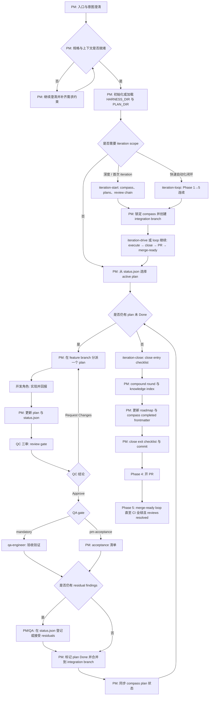

<div align="center">


# Morning Star (启明星)

编码智能体 Harness 框架

[English](README.md) / 中文

<a href="https://github.com/btspoony/mstar-harness">GitHub</a> · <a href="https://github.com/btspoony/mstar-harness/issues">Issues</a>

[](https://github.com/btspoony/mstar-harness/actions/workflows/ci.yml)
[](LICENSE)
[](https://github.com/btspoony/mstar-harness/releases)
[](https://github.com/btspoony/mstar-harness/commits/main)
[](https://www.npmjs.com/package/@mstar-harness/cli)

</div>

**Morning Star / 启明星** 是面向 AI 编码宿主的多角色 code harness。

- 快速启动一套可用的多角色协作流
- 通过统一的 `mstar-*` skills 执行，而不是散落规则
- **推荐宿主顺序**（最佳 → 可用）：**omp ≥ OpenCode ≥ Cursor > Kimi = ZCode > Codex** —— omp/OpenCode/Cursor 的 subagent + Plan UX 最完整；Kimi/ZCode 仅支持内置 agent 类型；Codex 派发面最受限。

更新说明：[CHANGELOG.md](CHANGELOG.md) / [CHANGELOG_CN.md](CHANGELOG_CN.md)。

## 安装

```bash
npx @mstar-harness/cli init
# 或：bunx @mstar-harness/cli init
```

| 宿主 | 命令 |
|------|------|
| omp | `npx @mstar-harness/cli init --target omp`（链接 `~/.mstar/harness`）或 `omp plugin install github:btspoony/mstar-harness` |
| OpenCode | `npx @mstar-harness/cli init --target opencode` |
| Cursor | `npx @mstar-harness/cli init --target cursor` |
| Kimi | Kimi TUI：`/plugins install https://github.com/btspoony/mstar-harness` → `/plugins reload` |
| ZCode | `npx @mstar-harness/cli init --target zcode`，然后在 ZCode → 设置 → 插件管理安装 **morning-star-harness** |
| Codex | `npx @mstar-harness/cli init --target codex`，然后 `codex plugin add morning-star-harness --marketplace personal` |

校验：`npx @mstar-harness/cli doctor --target <opencode\|cursor\|codex\|zcode\|omp>`。

手动安装 / 路径布局：[`INSTALL.md`](INSTALL.md)。CLI 参数：[`docs/cli.md`](docs/cli.md)。

安装后重载宿主（重启 OpenCode / Cursor **Developer: Reload Window** / 重开 Codex / Kimi `/plugins reload` 或 `/new` / ZCode 重载插件 / omp 新会话或 `/reload-plugins`）。

## 使用

三种入口：**不跑迭代**（单 plan / hotfix）、**跑迭代**（多 plan Phase 1–5）、或 **代码库审计**（发现该做什么）。

### 通用（不跑迭代）

进入 PM，然后走 per-plan 循环：`Prepare → Execute → QC → QA gate → Done`。

| 宿主 | 进入 PM |
|------|---------|
| omp | 每会话 `/skill:pm`（无自动加载） |
| OpenCode | `agent.project-manager`（`agents/project-manager.md`） |
| Cursor | `/pm` |
| Kimi | 新会话自动加载 `pm`；或 `/skill:pm` |
| ZCode | 每会话 `/morning-star-harness:pm`（无自动加载） |
| Codex | `/pm` |

宿主说明（Kimi/ZCode 仅内置 agent 类型 + prompt 角色绑定；omp 优先用 live schema 中由 `agents/*.md` 发现的角色 agent，并保留 C5b skill load）：`mstar-host/references/kimi.md`、`mstar-host/references/zcode.md`、`mstar-host/references/omp.md`。

### 迭代

| 路径 | 何时 |
|------|------|
| `/iteration-start` → `/iteration-drive` | 首次迭代，或需要人工方向锁定后再执行 |
| `/iteration-loop` | Phase 1→5 连续少确认（可选 `direction`、`scale` S\|M\|L\|XL） |

### 代码库审计

| 路径 | 何时 |
|------|------|
| `/codebase-audit` | 只读扫描代码库 → 向 `{PLAN_DIR}/audit-<date>/` 写入优先级排序、自包含的改进计划 |

只读顾问——**不**改源码。产出可喂给 iteration-start Research 或常规 Prepare → Execute。深度级别：`quick` / `standard`（默认） / `deep`；可按类别聚焦（`security`、`perf`、`tests`、…）或用 `branch` / `next` 变体。SSOT → `mstar-audit`。

### 命令加载

| 宿主 | 命令加载 |
|------|----------|
| omp | `/iteration-start` · `/iteration-drive` · `/iteration-loop` · `/codebase-audit`（插件 `commands/` 文件名命令） |
| Cursor / OpenCode | 从 `commands/` 打包（OpenCode：插件 `harness-commands/`） |
| Kimi / ZCode | 插件 manifest：`/morning-star-harness:iteration-start` · `:codebase-audit` 等 |
| Codex project | `.agents/skills/<name>/SKILL.md`（CLI 从 `commands/` 软链） |
| Codex global | **不**装 project 命令 — 用 `--scope project` |

Phase 2 默认：每 plan worktree + lease，`Findings cleanup: zero-residual`。仅显式 `Worktree mode: waived` / `Findings cleanup: allow-residual` 可覆写。SSOT → `mstar-iteration`、`mstar-branch-worktree`、`mstar-plan-artifacts`。

项目知识脚手架：`mstar-compound-refresh` → `references/project-knowledge-bootstrap.md`。

## Harness Workflow（统一流程）


```mermaid
flowchart TD
    A["PM: 入口与意图澄清"] --> B{"PM: 规格与上下文是否就绪"}
    B -->|否| C["PM: 继续澄清并补齐需求约束"]
    C --> B
    B -->|是| D["PM: 初始化或加载 HARNESS_DIR 与 PLAN_DIR"]
    D --> E{"是否需要 iteration scope"}
    E -->|深度 / 首次 iteration| F["iteration-start: compass、plans、review chain"]
    E -->|快速自动化闭环| F2["iteration-loop: Phase 1→5 连续"]
    F --> G["PM: 锁定 compass 并创建 integration branch"]
    F2 --> G
    G --> H["iteration-drive 或 loop 继续: execute → close → PR → merge-ready"]
    E -->|否| I["PM: 从 status.json 选择 active plan"]
    H --> I
    I --> J{"是否仍有 plan 未 Done"}
    J -->|是| K["PM: 在 feature branch 分派一个 plan"]
    K --> L["开发角色: 实现并回报"]
    L --> M["PM: 更新 plan 与 status.json"]
    M --> N["QC 三审: review gate"]
    N --> O{"QC 结论"}
    O -->|Request Changes| K
    O -->|Approve| P{"QA gate"}
    P -->|mandatory| P1["qa-engineer: 验收验证"]
    P -->|pm-acceptance| P2["PM: acceptance 清单"]
    P1 --> Q{"是否仍有 residual findings"}
    P2 --> Q
    Q -->|是| R["PM/QA: 在 status.json 登记或接受 residuals"]
    R --> S["PM: 标记 plan Done 并合并到 integration branch"]
    Q -->|否| S
    S --> T["PM: 同步 compass plan 状态"]
    T --> J
    J -->|否| U["iteration-close: close entry checklist"]
    U --> V["PM: compound round 与 knowledge index"]
    V --> W["PM: 更新 roadmap 与 compass completed frontmatter"]
    W --> X["PM: close exit checklist 与 commit"]
    X --> Y["Phase 4: 开 PR"]
    Y --> Z["Phase 5: merge-ready loop 直至 CI 全绿且 reviews resolved"]
```

不跑迭代：同一套 per-plan gate，无 `iteration-start` / `iteration-close` 外层。

## 角色与技能

| Agent ID | 职责 |
|----------|------|
| `project-manager` | 路由、分派、阶段推进 |
| `product-manager` | 需求、产品规划、研究 |
| `architect` | 架构与技术契约 |
| `fullstack-dev` / `fullstack-dev-2` | 后端主导实现 / 第二并行轨 |
| `frontend-dev` | UI、交互、前端性能 |
| `qa-engineer` | `QA gate: mandatory` 时验收 |
| `qc-specialist` / `-2` / `-3` | QC 三审 |
| `ops-engineer` | 部署、监控、基础设施 |
| `writing-specialist` | 文档、小说、文案、脚本 |
| `prompt-engineer` | prompt / skill / rule |

先读 **`mstar-harness-core`**，再按需加载专题 skill（见 `mstar-roles`）。

| Skill | 作用 |
|-------|------|
| `mstar-harness-core` | 入口、状态机、Task category、skill 索引 |
| `mstar-phase-gates` | Prepare/Execute、clarify、hotfix |
| `mstar-iteration` | Phase 1–5 迭代生命周期 |
| `mstar-dispatch-gates` | 派发、Delegation、反递归 |
| `mstar-sdd` | 子代理驱动开发 |
| `mstar-branch-worktree` | 分支、worktree、QC/QA 检出 |
| `mstar-plan-conventions` | `{HARNESS_DIR}` 发现 / 初始化 |
| `mstar-plan-artifacts` | plan、`status.json`、residual、Findings cleanup |
| `mstar-design-md` | UI plan 的 DESIGN.md 门禁 |
| `mstar-review-qc` | PM QC tri 编排 |
| `mstar-coding-behavior` | RCA、测试优先、审查反馈、证据 |
| `mstar-compound` / `mstar-compound-refresh` | 知识结晶 / 维护 |
| `mstar-strategy` | `STRATEGY.md` 对齐 |
| `mstar-skill-authoring` | skill 编写契约 |
| `mstar-audit` | 只读代码库审计 → 优先级改进计划 |
| `mstar-roles` | 角色提示词 + 加载清单 |
| `mstar-host` | 宿主适配（omp / OpenCode / Cursor / Kimi / ZCode / Codex） |
| `pm` | `/pm` / `/skill:pm` / 宿主 PM 入口 |

消费方 plan 默认 **`.mstar/`**。进程产物（`plans/`、`iterations/`、`status.json`、`sdd/` 等）gitignored；跟踪结果：`{HARNESS_DIR}/AGENTS.md`、`knowledge/`、`specs/`。Specs 解析：`.mstar/specs/` → `docs/specs/` → 仓库根 `specs/`。细则 → `mstar-plan-conventions`。

维护者：[`AGENTS.md`](AGENTS.md)。

## 许可

MIT，见 [LICENSE](./LICENSE)。
