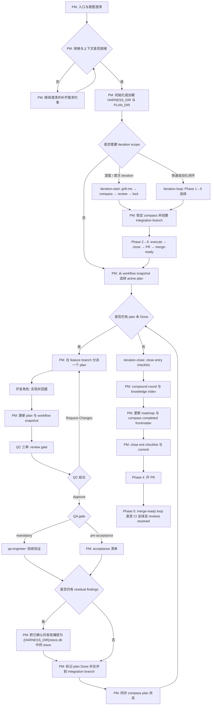

<div align="center">


# [Morning Star](https://github.com/btspoony/mstar-harness)

Harness Workflow Engine · Agent Plugin

[English](README.md) / 中文

<a href="https://github.com/btspoony/mstar-harness">GitHub</a> · <a href="https://github.com/btspoony/mstar-harness/issues">Issues</a>

[](https://github.com/btspoony/mstar-harness/actions/workflows/ci.yml)
[](LICENSE)
[](https://github.com/btspoony/mstar-harness/releases)
[](https://github.com/btspoony/mstar-harness/commits/main)
[](https://dshfind.com/zh/plugins/btspoony/mstar-harness?ref=badge)
[](https://www.greptile.com/?utm_source=oss_badge&utm_medium=readme&utm_campaign=greptile_for_open_source)

[](https://www.npmjs.com/package/@mstar-harness/cli)
[](https://www.npmjs.com/package/@mstar-harness/dsh)
[](https://www.npmjs.com/package/@mstar-harness/omp)
[](https://www.npmjs.com/package/@mstar-harness/opencode)

</div>

**Morning Star / 晨星** 是面向 harness 工程工作流的 Agent Plugin：TypeScript **Harness Workflow Engine**（`@mstar-harness/engine`）强制执行确定性工作流门禁，`mstar-*` 判断型 skills 驱动多智能体代码交付。

- **确定性门禁，由 TS 引擎强制执行** —— path/status/lease/dispatch/sdd/iteration/lint 门禁运行在 `@mstar-harness/engine` 中，而非仅靠 prompt 建议
- **判断留在 `mstar-*` skills** —— skills 仍是角色、门禁与工作流判断的唯一事实来源（SSOT）
- **一个引擎跨宿主** —— 同一引擎 + skills 驱动 dsh（DeepSeek Harness）、omp、OpenCode、Cursor、Kimi Code、ZCode、Codex
- **Agent Plugin 打包** —— 一条命令安装；可移植到任意 Agent Plugins v1.0.0 客户端
- **可插拔 JSON 持久化** —— 协调文档（`status.json`、workflow snapshots、review envelopes）经 `ArtifactStore` 持久化；默认 `FsStore` 保持既有 `.mstar/` 路径，集成方可经 `MSTAR_STORE_MODULE` / `--store` / 进程内 `setArtifactStore` 挂载自有存储
- **Issue/catalog 库 vs 执行 JSON** —— 激活后 `{HARNESS_DIR}/store.db`（SQLite）是 issue 与 catalog 权威；`ArtifactStore` 仍是执行/审查 JSON（`status.json`、snapshots）。已退役的 project register 是迁移历史，没有写入路径，open item 以 store 中的 issue 为准。两者不是同一存储。
- **推荐宿主**（最佳 → 可用）：**dsh = omp ≥ ZCode = OpenCode = Cursor > Kimi > Codex**

**交付内容**

| 组件 | 说明 |
|------|------|
| Harness Workflow Engine | `@mstar-harness/engine` —— 确定性工作流门禁的 TS 强制执行层 |
| mstar CLI | `@mstar-harness/cli` —— 安装引导 + `mstar` 工作流动词 |
| `mstar-*` skills | 角色、门禁与工作流判断（唯一事实来源） |
| 宿主适配 | dsh、omp、OpenCode、Cursor、Kimi Code、ZCode、Codex |

更新说明：[CHANGELOG.md](CHANGELOG.md) / [CHANGELOG_CN.md](CHANGELOG_CN.md)。

## 安装

| 宿主 | 命令 |
|------|------|
| dsh（DeepSeek Harness） | `npx @mstar-harness/cli init --target dsh`<br>（一条 CLI 命令编排两条**独立** `dsh plugin --profile web add` 安装：<br>`@mstar-harness/dsh` + `dsh-llm-fallbacks`；`--no-fallbacks` 可跳过后者）<br>或 `dsh plugin --profile web add @mstar-harness/dsh`<br>+ `dsh plugin --profile web add dsh-llm-fallbacks` |
| omp | `npx @mstar-harness/cli init --target omp`<br>（链接 `~/.mstar/harness/packages/omp`）<br>或 `omp plugin install @mstar-harness/omp` |
| OpenCode | `npx @mstar-harness/cli init --target opencode` |
| Cursor | `npx @mstar-harness/cli init --target cursor` |
| Kimi | Kimi TUI：`/plugins install https://github.com/btspoony/mstar-harness`<br>→ `/plugins reload` |
| ZCode | `npx @mstar-harness/cli init --target zcode`<br>然后在 ZCode → 设置 → 插件管理安装 **morning-star-harness** |
| Codex | `npx @mstar-harness/cli init --target codex`<br>然后 `codex plugin add morning-star-harness@mstar-repo`（仓库自带 marketplace） |
| Generic（Agent Plugins v1） | 任意 Agent Plugins v1.0.0 兼容客户端直接指向本仓库根<br>（`plugin.json` + `skills/` 即便携包） |

> 本节的 CLI 命令都通过 Bun shebang 执行已发布的 bin：`npx` / `bunx` / `npm i -g` 都需要 PATH 上有 **Bun >=1.4.0**。纯 Node 机器：`npm install @mstar-harness/cli`，然后 `node node_modules/@mstar-harness/cli/dist/mstar-harness.js <verb>`（见下文**运行时下限**）。

### 引擎门禁校验（推荐）

```bash
npm i -g @mstar-harness/cli
```

将 `mstar-harness` 二进制（短别名 `mstar`）装上 PATH，技能文本引用的引擎校验命令（`mstar status validate`、`mstar dispatch validate`、`mstar iteration gate` 等）才真正可运行。

`init` 会在成功运行后自动全局安装匹配版本的 CLI——传 `--no-global-cli` 可跳过。

不全局安装时 harness 照常工作，这些校验保持 advisory。在迭代 compass 里设 `enforcement: hard` 可让派发预检 fail-fast。

> **注意**：`mstar` 是短别名，且属于**共享 bin 命名空间**——名为 `mstar` 的无关第三方 npm 包也声明了同名命令。该别名仅在安装了 `@mstar-harness/cli` 的环境中存在：未安装该包时裸 `npx mstar …` 会经 registry 解析到那个第三方工具；两者全局共存时，后安装者会静默覆盖 `mstar` shim。规范调用名保持 `mstar-harness`——冲突时请使用长名。

### 校验

`npx @mstar-harness/cli doctor --target <opencode|cursor|codex|zcode|omp|dsh|kimi>` 检查所选宿主；Codex 还支持 `--scope <global|project>`。MCP 包健康状态为 aligned、mismatch 或 unavailable。Doctor 读取包 metadata/可执行文件并检查运行时下限，不会打开 issue store。见 [MCP 宿主安装路径](#mcp-宿主安装路径)。

Codex 角色链接修复与具名子代理验证：[Codex 安装](INSTALL.md#codex)。

仓库根提供便携式 **Agent Plugins v1.0.0** manifest（`plugin.json`），`skills/` 为 Agent Skills 组件——可用 `npx @mstar-harness/cli plugin validate` 校验。

手动安装 / 路径布局：[`INSTALL.md`](INSTALL.md)。CLI 参数：**`mstar-use-cli`** skill。


### 运行时下限（按入口，不是“两套都装”）

已发布 CLI 保留 Bun shebang（`#!/usr/bin/env bun`）。正常启动 `mstar-harness` / dist 文件使用 **Bun >=1.4.0**。显式 `node <CLI bundle>` 使用 **Node >=24.18.0**。`npx` / `bunx` 会下载该包，但仍执行同一个 Bun shebang bin，因此同样需要 PATH 上有 **Bun >=1.4.0**——包运行器不是运行时；纯 Node 机器请安装该包并用 Node 显式运行 bundle（`node node_modules/@mstar-harness/cli/dist/mstar-harness.js <verb>`）。Bun 宿主插件需要 Bun；原生 Node 入口需要 Node。不要把这两条下限理解成每台机器都必须同时安装两个运行时。本文不证明打包兼容或 store 激活就绪。

## 使用

三种入口：**不跑迭代**（单 plan / hotfix）、**跑迭代**（多 plan Phase 1–5）、或 **审计、Review 与验证**（发现工作、评估变更，或执行明确请求的 E2E 检查）。

完整命令参考：[`docs/commands.md`](docs/commands.md)。

### 通用（不跑迭代）

进入 PM，然后走 per-plan 循环：`Prepare → Execute → QC → QA gate → Done`。

| 宿主 | 进入 PM |
|------|---------|
| dsh（DeepSeek Harness） | `pm` skill（经 mstar skill 提供者；无自动加载） |
| omp | 每会话 `/skill:pm`（无自动加载） |
| OpenCode | `agent.project-manager`（仅 OpenCode 的 shell，`packages/opencode/agents/project-manager.md`） |
| Cursor | `/pm` |
| Kimi | 新会话自动加载 `pm`；或 `/skill:pm` |
| ZCode | 每会话 `/morning-star-harness:pm`（无自动加载） |
| Codex | `/pm` |

### 迭代

| 命令 | 何时 |
|------|------|
| `/iteration-start [direction] [pause]` | 开始新迭代：Phase 1（交互式 grill-me），然后自动推进 Phase 2→6。<br>`direction` — 可选提示（仍走交互）。<br>`pause` — 止于 Phase 1；之后用 `/iteration-drive` 恢复。 |
| `/iteration-drive` | 在已锁定的迭代上恢复 / 继续推进 Phase 2→6。 |
| `/iteration-loop [direction] [scale]` | Phase 1→6 全自动（无 grill-me）。<br>`direction` — 可选自由文本。<br>`scale` — `S` / `M` / `L` / `XL`（默认 `M`）。 |

### 直接计划协调

唯一 primary coordinator 通过普通 `mstar plan prepare`、`progress` 与 `complete` 推进选定 workflow 的所有行。Leaf 任务保留常规 SDD、独立 worktree、QC 三审与 QA 门禁。配置可修订；默认 mandatory QA 与 allow-residual cleanup，不要求 sealed Assignment 或逐行 bind。

`/iteration-drive` 只接受无参数调用。旧 scoped 或其他非空参数在 boot 前被拒绝，不会改为启动整个迭代。独立终端 PM 与所有权转交完成路线已移除。

完成仍有三种不同义务：迭代行证明实际串行集成合并并保留父级交付；standalone development 证明登记的 source 后继续 compound/PR/核实合并/close；standalone report-only 在 Done 前消费明确记录的策略履行，再凭证据 close，不虚构 Git/PR。

标志、JSON 与恢复 → `mstar-use-cli/references/plan-and-workflow.md`；配方 → [`docs/commands.md`](docs/commands.md#iteration-drive)。

### 审计、Review 与验证

审计与 Review 命令提供只读建议；发现可转为 plan 进入 Prepare → Execute。SSOT → `mstar-audit`（变体：`codebase-audit`、`tests`、`pr`）。

| 命令 | 何时 |
|------|------|
| `/codebase-audit [关键词]` | 只读扫描代码库里值得做的事 —— 产出按优先级排序、可直接执行的改进计划；可按类别聚焦（`bug`、`security`、`perf`、`tech-debt`、…）做定向深扫。 |
| `/amazing-pr-review [pr\|branch\|scope] [quick\|default\|deep]` | 合并前对 PR / 分支 / diff 做深度审查，三档强度：`quick`（单趟 1 席）/ `default`（无 flag 默认档，席位精简）/ `deep`（完整三阶段流水线）→ 给出唯一结论（`ship it` / `needs fixes` / `blocked`）与全部发现；有 PR 编号时由命令主代理在 Stage 3 合成阶段发布 GitHub Review。`deep` 档走完整三阶段流水线（collect → domain review → main-agent synthesis；one verdict / one GitHub Review）；`default` / `quick` 为更轻量的单/双席通道。多 PR 输入 → 仅审查第一个 PR；其余 PR 登记为审计待办（下一次会话）；建议一个会话只审一个 PR。 |
| `/amazing-test-audit [scope\|subsystem] [quick\|deep] [campaign]` | 对既有测试面做只读审计 —— 扫 junk 模式、按价值/保留门槛评分，产出删除、修复、合并或迁移测试的优先级计划；`campaign` 先为某个子系统的每条声明打出 R/F/C/D 台账。 |
| `/amazing-e2e-check [环境/设备] [场景]` | 通过 `mstar-e2e` 在独立 workflow 中执行用户明确请求的浏览器、真机或安装部署场景；不作为常规迭代 QA 门禁。 |

### 本地看板（dashboard）

`mstar dashboard` 在 `127.0.0.1` 上提供 issue store 与执行/roadmap 投影的**只读** Web 界面——仅回环绑定，不提供任何 bind 地址选项。覆盖：issue 列表与详情（含真实记录历史）、workflow / iteration / roadmap 视图，以及一张累计捕获 vs 退役的 issue-flow 图表。看板不做任何变更；改动一律走 CLI（`mstar issue …`、`mstar catalog …`），Ctrl-C 停止服务。

```
mstar dashboard            # 服务开始监听后打印解析得到的 URL
mstar dashboard --help     # --port / --open / --project
```

### 命令契约

除安装器以外的命令都由 `@mstar-harness/commands` 的同一份规范定义生成。`mstar init` 仍是安装器，不是生成命令。成功、拒绝和用法各自打印 version-1 JSON 信封；普通退出码是 0、1、2。缺失的 SDD task 仍退出 3，子进程仍原样传播 124、127 和 128+n。下面的例子是合成示例。本文不声称已在已安装宿主、浏览器或在线服务上运行过。

```text
mstar schema CaptureInput
mstar host detect --signals question
```

### 离线报告草稿

`mstar report` 会为 GitHub issue 表单生成离线草稿；它不会读取凭据或文件、提交 issue，也不会发起网络请求。只提供你选择的报告字段：`title`、`command`、`arguments`、`expected`、`actual`、`reproduction`、`stableCode`、`exitStatus`、`host`、`platform` 和 `versionOverrides`。未提供的叙述字段会标记为 `absent`；无法观测到的版本会标记为 `unknown`。版本覆盖值会明确标为调用方提供。每个文本字段最多 8192 UTF-8 字节，所有提供的文本合计最多 32768 字节；`arguments` 最多 128 项。

报告复用一组有限的脱敏模式：私钥块、AWS access key、GitHub token 和 PAT、Stripe live key、Slack token、JWT、`sk-` API key、凭据类键值赋值（`password`、`passwd`、`api-key`、`access-token`、`auth-token`、`secret` 或 `token`），以及四种 CI/IaC 形态（GitHub Actions 明文 secret 环境变量、回显的 Actions secret、凭据命名的 Docker `ENV`/`ARG`、Terraform 硬编码密码）。脱敏计数按字段统计不同的匹配行/类型发现，不是出现次数。有限模式不能保证移除所有 secret；请自行检查草稿。

```bash
mstar report --title "Synthetic example" --command "mstar status" \
  --expected "workflow is listed" --actual "workflow is missing" \
  --stable-code "workflow.not-found" --exit-status 1
```

生成的提示会要求你在提交前检查草稿。CLI 与 MCP 用法见[报告命令用法](INSTALL.md#report-command)。

### MCP 运行时

`mstar mcp` 由 `@mstar-harness/cli` 直接运行 stdio MCP server，与 CLI 共用同一个包。它将规范定义中的非安装器命令注册为 MCP tools（工具名以 `mstar_` 开头，并将命令 ID 中的点和连字符替换为下划线）。不再提供独立的 `@mstar-harness/mcp` 包、宿主专属 bundle 或原生桥接。

六个宿主配置通过 `npx @mstar-harness/cli mcp` 启动 CLI；DSH 的 Cordis YAML 启动项仍待后续接入。这要求 CLI 中包含 `mcp` 命令的版本已发布；在该版本发布前，`npx` 可能解析到尚不识别该命令的旧版 CLI。CLI 与引擎要求 Node.js >=24.18.0。

```json
{
  "mcpServers": {
    "morning-star": {
      "command": "npx",
      "args": ["@mstar-harness/cli", "mcp"]
    }
  }
}
```

`sessionId` 选择主对话会话，不是派生子代理的会话。可选的 `host` 用于选择受支持的宿主上下文；它不是角色，也不授予权限。请求是否允许，仍由现有共享处理器中的 workflow ownership、路径、状态转换和 CAS 检查决定。拒绝结果保留稳定的命令信封与 code（并作为 MCP tool error 返回）；调用方应解释或解决拒绝原因，而不是换一种身份或路径重试绕过检查。这里说明的是软件包契约，不代表已在已安装宿主中运行。

示例均为合成示例；本文不声称已在已安装宿主、浏览器或在线服务上运行。
MCP 捕获的 SDD 证据记录为 `stable:false`；与 CLI 的采集器一致性仍是已记录的跨计划 residual。

### MCP 宿主安装路径

六个 JSON 宿主配置和 OpenCode 插件的 `config` hook 都通过 `npx @mstar-harness/cli mcp` 启动 CLI；DSH 的 Cordis YAML 启动行留待后续接入。`npx` 启动时可能下载 CLI 包，因此必须先发布包含 `mcp` 的 CLI 版本：

| 宿主 | MCP 配置 | 运行时 |
|------|----------|--------|
| omp | 插件 `mcp.json` | Node.js >=24.18.0 |
| OpenCode | `packages/opencode/mcp.json` 模板；插件加载时动态注入 OpenCode 的 `mcp` 配置 | Node.js >=24.18.0 |
| dsh | Cordis profile YAML MCP 启动行 — 后续跟进（此包不提供 JSON 配置） | 未配置 |
| Cursor | `.cursor-plugin/mcp.json` | Node.js >=24.18.0 |
| Codex | `.codex-plugin/mcp.json` | Node.js >=24.18.0 |
| Kimi | `.kimi-plugin/mcp.json` | Node.js >=24.18.0 |
| ZCode | `.zcode-plugin/mcp.json` | Node.js >=24.18.0 |

精确安装命令与配置细节见 [INSTALL.md](INSTALL.md#installing-the-mcp-tools)。宿主对应的实际产物也见 [`mstar-host` references](skills/mstar-host/SKILL.md)。

`doctor --target <host>` 将 MCP 配置状态报告为 **aligned**、**mismatch** 或 **unavailable**；配置 aligned 不代表已验证宿主实际运行。Doctor 检查配置的 CLI 启动参数和 Node.js 下限，**不会**启动 server 或打开 issue store。MCP 上下文遵循共享契约：可选 `host` 选择经校验的宿主上下文，`sessionId` 是主对话会话；不要求也不执行子代理归因。开发阶段的单测/组件/集成证据，不等于已安装宿主或在线验证；后者属于需单独授权的活动，本文不声称已完成。
OpenCode 插件通过动态 config hook 注册 MCP server；包内 `mcp.json` 是参考模板，不要求静态修改用户的 `opencode.json`。DSH 使用 Cordis YAML 插件行；其 npx 启动行是单独跟踪的宿主接入后续工作，目前 `doctor --target dsh` 会报告 unavailable。

## Harness Workflow（统一流程）


```mermaid
flowchart TD
    A["PM: 入口与意图澄清"] --> B{"PM: 规格与上下文是否就绪"}
    B -->|否| C["PM: 继续澄清并补齐需求约束"]
    C --> B
    B -->|是| D["PM: 初始化或加载 HARNESS_DIR 与 PLAN_DIR"]
    D --> E{"是否需要 iteration scope"}
    E -->|深度 / 首次 iteration| F["iteration-start: grill-me → compass → review → lock"]
    E -->|快速自动化闭环| F2["iteration-loop: Phase 1→5 连续"]
    F --> G["PM: 锁定 compass 并创建 integration branch"]
    F2 --> G
    G --> H["Phase 2→5: execute → close → PR → merge-ready"]
    E -->|否| I["PM: 从 workflow snapshot 选择 active plan"]
    H --> I
    I --> J{"是否仍有 plan 未 Done"}
    J -->|是| K["PM: 在 feature branch 分派一个 plan"]
    K --> L["开发角色: 实现并回报"]
    L --> M["PM: 更新 plan 与 workflow snapshot"]
    M --> N["QC 三审: review gate"]
    N --> O{"QC 结论"}
    O -->|Request Changes| K
    O -->|Approve| P{"QA gate"}
    P -->|mandatory| P1["qa-engineer: 验收验证"]
    P -->|pm-acceptance| P2["PM: acceptance 清单"]
    P1 --> Q{"是否仍有 residual findings"}
    P2 --> Q
    Q -->|是| R["PM: 把已确认的发现捕获为 {HARNESS_DIR}/store.db 中的 issue"]
    R --> S["PM: 标记 plan Done 并合并到 integration branch"]
    Q -->|否| S
    S --> T["PM: 同步 compass plan 状态"]
    T --> J
    J -->|否| U["iteration-close: close entry checklist"]
    U --> V["PM: compound round 与 knowledge index"]
    V --> W["PM: 更新 roadmap 与 compass completed frontmatter"]
    W --> X["PM: close exit checklist 与 commit"]
    X --> Y["Phase 4: 开 PR"]
    Y --> Z["Phase 5: merge-ready loop 直至 CI 全绿且 reviews resolved"]
```

不跑迭代：同一套 per-plan gate，无 `iteration-start` / `iteration-close` 外层。

## 角色与技能

| Agent ID | 职责 |
|----------|------|
| `project-manager` | 路由、分派、阶段推进 |
| `product-manager` | 需求、产品规划、研究 |
| `architect` | 架构与技术契约 |
| `fullstack-dev` / `fullstack-dev-2` | 后端主导实现 / 第二并行轨 |
| `frontend-dev` | UI、交互、前端性能 |
| `qa-engineer` | `QA gate: mandatory` 时验收 |
| `code-reviewer` | SDD per-task 快速验证；codebase audit（`audit` 类） |
| `qc-specialist` / `-2` / `-3` | QC 三审 |
| `ops-engineer` | 部署、监控、基础设施 |
| `writing-specialist` | 文档、小说、文案、脚本 |
| `prompt-engineer` | prompt / skill / rule |

先读 **`mstar-harness-core`**，再按需加载专题 skill（见 `mstar-roles`）。

| Skill | 作用 |
|-------|------|
| `mstar-harness-core` | 入口、状态机、Task category、skill 索引 |
| `mstar-phase-gates` | Prepare/Execute、clarify、hotfix |
| `mstar-iteration` | Phase 1–5 迭代生命周期 |
| `mstar-dispatch-gates` | 派发、Delegation、反递归 |
| `mstar-sdd` | 子代理驱动开发 |
| `mstar-branch-worktree` | 分支、worktree、QC/QA 检出 |
| `mstar-conventions` | `{HARNESS_DIR}` 发现 / 初始化 |
| `mstar-artifacts` | plan、`status.json`、issue 捕获指针、Findings cleanup |
| `mstar-project-governance` | roadmap 编写约定 + issue 捕获契约、register 迁移历史、`_default` 回退 |
| `mstar-design-md` | UI plan 的 DESIGN.md 门禁 |
| `mstar-review-qc` | PM QC tri 编排 |
| `mstar-coding-behavior` | RCA、测试优先、审查反馈、证据 |
| `mstar-compound` / `mstar-compound-refresh` | 知识结晶 / 维护 |
| `mstar-strategy` | `STRATEGY.md` 对齐 |
| `mstar-skill-authoring` | 通用 skill 撰写契约（SkillsBench 门控） |
| `mstar-audit` | 只读代码库审计 → 优先级改进计划 |
| `mstar-e2e` | 显式独立 E2E、浏览器、真机与安装部署验证 |
| `mstar-roles` | 角色提示词 + 加载清单 |
| `mstar-host` | 宿主适配（dsh / omp / OpenCode / Cursor / Kimi / ZCode / Codex） |
| `pm` | `/pm` / `/skill:pm` / 宿主 PM 入口 |

消费方 plan 默认 **`.mstar/`**。进程产物（`plans/`、`iterations/`、`status.json`、`workflows/`、`projects/`、`sdd/` 等）gitignored；跟踪结果：`{HARNESS_DIR}/AGENTS.md`、`knowledge/`、`specs/`。Specs 解析：`.mstar/specs/` → `docs/specs/` → 仓库根 `specs/`。布局非默认的仓库可在 gitignored 的 **`.mstarc`** 中声明全部 harness 目录符号（`[config]` 键 `harness_dir` / `plan_dir` / `sdd_dir` / `iteration_dir` / `knowledge_dir` / `specs_dir` / `workflow_dir` / `project_dir`，优先于探测）。细则 → `mstar-conventions`。

维护者：[`AGENTS.md`](AGENTS.md)。

## 许可

MIT，见 [LICENSE](./LICENSE)。
