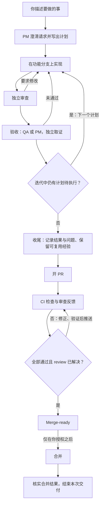

<div align="center">


# [Morning Star](https://github.com/btspoony/mstar-harness)

Harness Workflow Engine · Agent Plugin

[English](README.md) / 中文

<a href="https://github.com/btspoony/mstar-harness">GitHub</a> · <a href="https://github.com/btspoony/mstar-harness/issues">Issues</a>

[](https://github.com/btspoony/mstar-harness/actions/workflows/ci.yml)
[](LICENSE)
[](https://github.com/btspoony/mstar-harness/releases)
[](https://github.com/btspoony/mstar-harness/commits/main)
[](https://dshfind.com/zh/plugins/btspoony/mstar-harness?ref=badge)
[](https://www.greptile.com/?utm_source=oss_badge&utm_medium=readme&utm_campaign=greptile_for_open_source)

[](https://www.npmjs.com/package/@mstar-harness/cli)
[](https://www.npmjs.com/package/@mstar-harness/dsh)
[](https://www.npmjs.com/package/@mstar-harness/omp)
[](https://www.npmjs.com/package/@mstar-harness/opencode)

</div>

Morning Star 为你在用的 AI 编程工具带来一套交付流程 —— 支持 dsh、omp、OpenCode、Cursor、Kimi Code、ZCode 与 Codex。你描述需求，`project-manager` 负责澄清、维护计划，并把工作从需求推进到实现、审查、验收，直到 PR。需求、架构、实现、审查、验收、审计各自有专属角色负责。

**为什么用它**

- **从请求到 PR** —— 描述一次需求即可：PM 维护计划、召集合适的专职角色，并推进到 PR；工作中断时，计划里记录了进度，方便之后继续。
- **由专职角色分工，而不是一段超长 prompt** —— PM 负责编排；需求、架构、实现、QC、验收、审计、运维各有专属角色与明确边界。
- **留下可审计的轨迹** —— 计划、发现、审查报告与决策都记录在仓库的 harness 目录里，而不只是留在对话中。
- **边界都是明确的** —— 流程负责开 PR 并停在 merge-ready；是否合并由你决定。审计只读并给出报告；任何触及真实环境的操作都需要你的明确授权。

## 安装

前置条件：CLI 通过 **Bun >=1.4.0** 启动 —— `npx` / `bunx` 只负责拉取包，仍需 PATH 上有 Bun；
纯 Node 机器的做法是安装包后用 **Node >=24.18.0** 运行（`node node_modules/@mstar-harness/cli/dist/mstar-harness.js <verb>`）。

| 宿主 | 安装 |
|------|------|
| dsh（DeepSeek Harness） | `npx @mstar-harness/cli init --target dsh` —— 需要 PATH 上有 `dsh` CLI；会安装插件与 LLM fallbacks（`--no-fallbacks` 跳过后者） |
| omp | `npx @mstar-harness/cli init --target omp` —— 需要已安装 `omp` CLI |
| OpenCode | `npx @mstar-harness/cli init --target opencode` |
| Cursor | `npx @mstar-harness/cli init --target cursor` —— 会创建真实的插件 checkout，需要 `git` |
| Kimi Code | Kimi TUI：`/plugins install https://github.com/btspoony/mstar-harness`，然后 `/plugins reload` |
| ZCode | `npx @mstar-harness/cli init --target zcode`，再在 设置 → 插件管理 中安装 **morning-star-harness** |
| Codex | `npx @mstar-harness/cli init --target codex` —— 需要 `codex` CLI；会注册仓库 marketplace 并添加 `morning-star-harness@mstar-repo` |

`init` 默认使用 `--scope project`（`--scope global` 装到宿主全局；Codex 的 global scope 不安装七条斜杠命令 skill；对 dsh 该参数不生效 —— 它的 profile 是机器全局的），成功后还会全局安装同版本的 `@mstar-harness/cli` —— 加 `--no-global-cli` 可跳过。用 `npx @mstar-harness/cli doctor --target <host>` 检查结果，它会同时报告 MCP 配置为 `aligned`、`mismatch` 或 `unavailable`。

CLI 的正式命令名是 `mstar-harness`。短别名 `mstar` 只在安装了本包的环境中存在，而且有一个同名 npm 包声明了同样的名字 —— 有疑问时用长名。手动安装、路径布局与各宿主说明见 [`INSTALL.md`](INSTALL.md)。

## 使用

每个会话进入一次 PM，然后用你自己的话描述要做什么；PM 会在该会话中推进整个流程。

| 宿主 | 进入 PM |
|------|---------|
| dsh | `pm` skill |
| omp | `/skill:pm` |
| OpenCode | `Project Manager` agent，或 `/pm` |
| Cursor | `/pm` |
| Kimi Code | 会话自动加载，或 `/skill:pm` |
| ZCode | `/morning-star-harness:pm` |
| Codex | `/pm` |

### 单任务（不跑迭代）

给 PM 一个具体的请求，例如：*“给公开 API 加上限流，并补上测试。”* PM 会补全模糊之处、写计划，然后在功能分支上走完 实现 → 独立 QC 审查 → 验收 → 完成。本轮没有修掉的已确认问题会被记录为 issue，而不是丢掉。最终结果由你检查并合并。

### 迭代

| 命令 | 作用 |
|------|------|
| `/iteration-start [direction] [pause]` | Phase 1：通过交互式方向锁定（grill-me）产出本次迭代的 compass 与计划，随后自动推进执行、收尾、开 PR 到 merge-ready。`pause` 停在 Phase 1，稍后用 `/iteration-drive` 继续。 |
| `/iteration-drive` | 恢复或继续推进已锁定的迭代，不接受参数。 |
| `/iteration-loop [direction] [scale]` | 同样的生命周期全程自动，但没有交互阶段。`scale`（`S` / `M` / `L` / `XL`）限制本次迭代承接的 plan 数量。 |

一次迭代只有走完 post-merge 收尾才算结束：阶段关闭、PR 处于打开状态或 PR 已合并，单独都不算完成。各宿主的命令拼写不同 —— 有的需要插件前缀，Codex 只在 project scope 安装命令 skill；参数形式与各宿主差异见 [`docs/commands.md`](docs/commands.md)。

### 审计、Review 与验证

| 命令 | 作用 |
|------|------|
| `/codebase-audit [keywords]` | 只读盘点，产出按优先级排序、可直接执行的改进计划；按类别聚焦（`bug`、`security`、`perf`、`tech-debt`、…）可缩小范围。 |
| `/amazing-pr-review [pr\|branch] [quick\|default\|deep]` | 合并前审查 PR 或分支，三档强度，最终给出唯一结论：`ship it`、`needs fixes` 或 `blocked`。 |
| `/amazing-test-audit [scope] [quick\|deep] [campaign]` | 对测试面做只读审计 → 产出删除、修复、合并或迁移测试的计划。 |
| `/amazing-e2e-check [environment] [scenarios]` | 在独立 workflow 中运行你明确要求的浏览器、真机或安装部署场景。 |

审计类命令只读取并报告，不会改你的代码。有两条边界要知道：`/amazing-pr-review` 在你给出 PR 编号时会把发现以 comment review 发布到 GitHub —— 它从不 approve、request changes 或 merge；`/amazing-e2e-check` 只在你主动要求时运行，其中触及真实环境的步骤需要明确授权。

## 工作流


```mermaid
flowchart TD
    A["你描述要做的事"] --> B["PM 澄清请求并写出计划"]
    B --> C["在功能分支上实现"]
    C --> D["独立审查"]
    D -->|要求修改| C
    D --> E["验收：QA 或 PM，独立取证"]
    E -->|未通过| C
    E --> F{"迭代中仍有计划待执行？"}
    F -->|是：下一个计划| C
    F -->|否| G["收尾：记录结果与问题、保留可复用经验"]
    G --> H["开 PR"]
    H --> I["CI 检查与审查反馈"]
    I --> J{"全部通过且 review 已解决？"}
    J -->|否：修正、验证后推送| I
    J -->|是| K["Merge-ready"]
    K -->|仅在你授权之后| L["合并"]
    L --> M["核实合并结果，结束本次交付"]
```

主路径展示的是一次 **development** 交付。每个 plan 都会做 plan 级 QC 审查 —— 默认由三个独立席位执行 —— 多任务 plan 还会在实现阶段加入 per-task review。hotfix（或显式设为 inline 执行模式的 plan）走更轻的通道，审查席位更少。验收是独立取证的一环 —— 由 QA 或 PM 执行，而不是复述实现者的总结；本轮没有修掉的已确认问题会变成跟踪中的 issue，而不是丢掉。

**范围说明。** 迭代会先与你锁定方向，然后对承接的每个 plan 各跑一遍上述循环，最后统一收尾再开 PR；不跑迭代时，这套循环就只为一个 plan 执行一次。验证或 report-only 的交付物 —— 例如一次审计 —— 在达到约定的完成条件时结束，没有 PR，也没有合并环节。在 development 这条路径上，plan 只有在证据齐全时才算完成：plan 完成、merge-ready 与已合并是三件不同的事，只有核实合并、走完 post-merge 收尾，交付才算结束。是否合并是一次单独的授权 —— 你可以显式授权，也可以自己合并 —— 分支清理则是收尾之后单独的、显式的动作。

引擎负责校验流程中可机械校验的部分 —— 工作流状态流转、分支与 worktree 对齐、派发前置条件、plan 与 issue 记录。这些校验默认是 advisory：只报告问题；项目或迭代可以用 `enforcement: hard` 升级为阻断，具体能否阻断取决于宿主。过程状态（计划、workflow 记录、发现、审查报告）存放在 harness 目录，默认 `.mstar/`，默认被 gitignore。

## Dashboard：本地看板

只在本机 `127.0.0.1` 上提供的只读页面：在同一个界面里查看项目进展、未解决问题和路线图，对应你启动它时所在的仓库。页面有 Issues、Workflows、Iterations 和 Roadmap；在 Issues 中可以搜索和筛选、打开单条 issue 的已记录历史，并查看 issue 走势 —— 捕获与退役（captured vs retired）的累计趋势。页面本身不写入；修改通过 CLI 完成。

```text
mstar-harness dashboard
```

命令打印一行 JSON。打开其中的 `data.url`（`http://127.0.0.1:` 加上它实际绑定的端口），按 Ctrl-C 停止。`--port` 和 `--project <projectId>` 都是可选的；省略 `--port` 时由操作系统选择端口。页面不会推送实时更新。

细节见 [`docs/runtime-reference.md`](docs/runtime-reference.md#cli-contract)。

## MCP

在支持 MCP 的编程工具中，可以查看 issue、roadmap 和 workflow，并调用对应的 CLI 操作与检查，而不必编写 shell 命令。`mstar-harness mcp` 是本包中的 stdio 服务。它遵守与 CLI 相同的规则 —— 不是一项新权限 —— 也没有单独的 MCP 包。

安装之后，宿主通常已经带有启动配置，见 [`INSTALL.md`](INSTALL.md#installing-the-mcp-tools)。带静态 JSON 配置的宿主使用下面这种形式（`npx` 需要 PATH 上有 Bun，见上文「安装」）。不要把它粘贴到宿主已经写好的文件上。OpenCode 不读取静态文件 —— 它的插件通过 `config` hook 注入该服务。dsh 是例外：自带的配置行在 profile 包含 `@deepseek-ai/dsh-mcp-client` 之前不会生效（`dsh plugin --profile web add @deepseek-ai/dsh-mcp-client`）。

```json
{
  "mcpServers": {
    "morning-star": {
      "command": "npx",
      "args": ["@mstar-harness/cli", "mcp"]
    }
  }
}
```

命令细节见 [`docs/runtime-reference.md`](docs/runtime-reference.md#mcp)。

## 角色与技能

**project-manager** 在你的会话中运行并派发工作：需求与架构、后端与前端实现、QC 审查、验收、代码库与 PR 审计、运维、写作各自有专属角色。每个角色遵循 `mstar-*` skills 中的规则 —— 都是可以直接阅读、并按自己团队习惯调整的 Markdown。

## 命令行

`mstar-harness` CLI 覆盖会话之外的事务：issue、roadmap、工作流状态、各类校验、看板与 MCP。

- **直接问命令本身。** `--help` 会列出命令期望的输入；对 issue 的写操作，它还会逐条列出 payload 字段的类型，以及必填还是仅在特定处置方式下必填。用法被拒绝时，它会说明发现的问题、该看哪条 help，以及如何恢复。

```text
mstar-harness --help                        # 命令族
mstar-harness issue close --help            # 单个动词的选项与 payload 字段
mstar-harness schema --command issue.close  # 同一份契约的机器可读 JSON
```

- `mstar-harness report` 生成离线、脱敏的 GitHub issue 报告草稿，供你检查后再提交。

宿主接入、issue 与 roadmap 命令族，以及这些界面背后的细节，见 [`docs/runtime-reference.md`](docs/runtime-reference.md)。

## 文档

- [`docs/runtime-reference.md`](docs/runtime-reference.md) —— 组件、存储布局、角色与技能、CLI 与 MCP 参考。
- [`INSTALL.md`](INSTALL.md) —— 各宿主的安装与校验，以及 `report` 命令的完整说明。
- [`docs/commands.md`](docs/commands.md) —— 七条斜杠命令：参数、适用场景、归属 skill。
- [`CONCEPTS.md`](CONCEPTS.md) —— harness 在 skills 与文档中使用的术语表。
- 更新说明：[`CHANGELOG.md`](CHANGELOG.md) / [`CHANGELOG_CN.md`](CHANGELOG_CN.md)。CLI 参数：**`mstar-use-cli`** skill。
- 维护者：[`AGENTS.md`](AGENTS.md)。

## 许可

MIT，见 [LICENSE](./LICENSE)。
